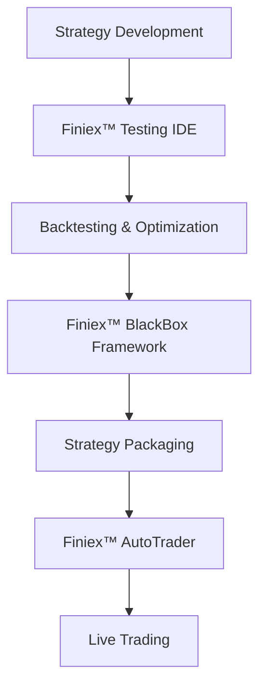

# Finiex™ Testing IDE

**© 2025 Frank Krätzig. All rights reserved.**  
**Finiex™ is a trademark of Frank Krätzig.**

---

## Professional Trading Strategy Testing & Development Environment

Revolutionary IDE-like platform for testing trading strategies with IP protection, massive parallelization, and reproducible results.

**Finiex™ Testing IDE** is part of the comprehensive **Finiex™** trading ecosystem and solves the fundamental problem of trading strategy development:
*"How do you test strategies fast, fair, and reproducibly - without revealing your IP?"*

### 🏗️ Finiex™ Ecosystem Overview

The **Finiex™** platform consists of four integrated components:

1. **🎯 Finiex™** - The master brand and core framework
2. **🧪 Finiex™ Testing IDE** - Strategy development and backtesting platform *(this repository)*
3. **🤖 Finiex™ AutoTrader** - Automated live trading execution system *(coming soon)*
4. **🔒 Finiex™ BlackBox Framework** - IP-protected strategy deployment system *(in development)*

### 🚀 Key Features

✅ **Blackbox-API** - Strategies remain secret, testing stays transparent  
✅ **Massive Parallelization** - 1000+ scenarios simultaneously  
✅ **Reproducible Results** - Deterministic seeds & immutable snapshots  
✅ **Visual Debug System** - See every indicator, signal, and calculation  
✅ **Production Ready** - Seamless handover to **Finiex™ AutoTrader**  
✅ **IP Protection** - Integrated with **Finiex™ BlackBox Framework**

### 🔄 Workflow Integration



### 🏗️ Technical Architecture

```
MQL5 Data Collection → JSON Export → Python Pipeline → Parquet Database → Finiex™ Testing IDE
                                                                              ↓
Finiex™ BlackBox Framework ← Strategy Validation ← Performance Analysis ←─────┘
                ↓
        Finiex™ AutoTrader → Live Trading Execution
```

**Why This Stack:**
- **MQL5**: Live tick data from any forex broker
- **Apache Arrow/Parquet**: Zero-copy performance for big datasets
- **Python Multiprocessing**: True parallelism (no GIL limits)
- **Finiex™ BlackBox Framework**: IP protection + standardized interface
- **Finiex™ AutoTrader Integration**: Seamless production deployment

## 📊 Quick Start

### Step 1: Data Collection

```bash
# 1. Install MQL5 TickCollector in MetaTrader 5
cp mql5/TickCollector.mq5 [MetaTrader]/MQL5/Experts/

# 2. Run on EURUSD chart for 48 hours
# → Generates JSON tick data in C:/FiniexData/

# 3. Expected output: 300-900MB raw tick data
```

### Step 2: Setup Finiex™ Testing IDE

```bash
# 1. Setup environment
pip install -r requirements.txt

# 2. Convert JSON to Parquet
python python/tick_importer.py

# 3. Test data loading
python python/data_loader.py
```

### Step 3: Create Your Strategy with Finiex™ BlackBox Framework

```python
from finiex.blackbox_framework import BlackboxBase, Signal

class MyTradingStrategy(BlackboxBase):
    """
    Strategy compatible with Finiex™ Testing IDE and Finiex™ AutoTrader
    """
    
    def get_parameter_schema(self):
        return {
            'rsi_period': {'type': 'int', 'default': 14, 'description': 'RSI Period'},
            'profit_target': {'type': 'float', 'default': 0.002, 'description': 'Profit Target %'}
        }
    
    def on_tick(self, tick):
        # Your secret trading logic here
        rsi = self.indicators.rsi(self.price_history, self.parameters['rsi_period'])
        
        # Visual debug (only in Finiex™ Testing IDE)
        self.add_line_point("rsi", rsi, tick.timestamp)
        
        if rsi < 30:
            return Signal("BUY", price=tick.ask, target=self.parameters['profit_target'])
        elif rsi > 70:
            return Signal("SELL", price=tick.bid, target=self.parameters['profit_target'])
        
        return Signal("FLAT")
    
    def get_finiex_metadata(self):
        """Required for Finiex™ AutoTrader deployment"""
        return {
            'name': 'RSI Strategy',
            'version': '1.0.0',
            'risk_level': 'medium',
            'compatible_pairs': ['EURUSD', 'GBPUSD'],
            'finiex_framework_version': '1.0'
        }
```

## 📈 Performance Targets

| Metric | Target | Status |
|--------|--------|--------|
| Time-to-First-Backtest | < 30 min | 🟡 In Progress |
| Parallel Scenarios | 1000+ | 🟡 In Progress |
| Determinism Rate | ≥ 99% | 🟡 In Progress |
| Data Compression | 10:1 ratio | ✅ Achieved |
| BlackBox Integration | 100% | 🟡 In Progress |
| AutoTrader Compatibility | 100% | 🔄 Planned |

## 📂 Project Structure

```
docs/                    # Complete Finiex™ ecosystem documentation
mql5/                    # MetaTrader 5 data collectors  
finiex/
├── testing_ide/         # Core Finiex™ Testing IDE
├── blackbox_framework/   # Finiex™ BlackBox Framework (IP protection)
├── autotrader_bridge/    # Bridge to Finiex™ AutoTrader
└── core/                # Shared Finiex™ core components
data/                    # Tick data storage (gitignored)
examples/
├── strategies/          # Sample strategies for all Finiex™ components
├── testing_scenarios/   # Testing IDE examples
└── deployment_configs/  # AutoTrader deployment examples
scripts/                 # Utility scripts for entire Finiex™ ecosystem
```

## 🛣️ Finiex™ Ecosystem Roadmap

### Finiex™ Testing IDE (Current Repository)
- [x] **Blackbox Framework Integration**
- [x] **MQL5 Data Pipeline**  
- [ ] **Multi-Process Testing Engine**
- [ ] **Advanced Visual Debug System**
- [ ] **Strategy Performance Analytics**

### Finiex™ BlackBox Framework
- [ ] **Strategy Encryption & Obfuscation**
- [ ] **IP Protection Layer**
- [ ] **Secure Strategy Distribution**
- [ ] **License Management System**

### Finiex™ AutoTrader
- [ ] **Live Trading Engine**
- [ ] **Risk Management System**
- [ ] **Multi-Broker Connectivity**
- [ ] **Real-time Performance Monitoring**
- [ ] **Strategy Portfolio Management**

### Finiex™ Platform Integration
- [ ] **Unified Web Dashboard**
- [ ] **Cross-Component Data Sync**
- [ ] **Enterprise Authentication**
- [ ] **SaaS Platform Beta**

## 🤝 Contributing

We welcome contributions to the **Finiex™** ecosystem! Please see [CONTRIBUTING.md](docs/contributing.md) for guidelines.

### Development Guidelines
- All code must be compatible across the **Finiex™** ecosystem
- Follow **Finiex™ BlackBox Framework** standards for strategy development
- Ensure **Finiex™ AutoTrader** compatibility for production strategies

## 🚀 Installation

```bash
git clone https://github.com/dc-deal/FiniexTestingIDE.git
cd FiniexTestingIDE
pip install -r requirements.txt
python scripts/setup_finiex_ecosystem.py
```

## 📄 License

This project is licensed under the MIT License - see the [LICENSE](LICENSE) file for details.

**Important**: All **Finiex™** trademarks and names remain the exclusive property of Frank Krätzig, regardless of the MIT license terms.

## 📞 Contact & Support

**Finiex™ Ecosystem Creator**: Frank Krätzig ([dc-deal](https://github.com/dc-deal))  
**Issues**: [GitHub Issues](https://github.com/dc-deal/FiniexTestingIDE/issues)  
**First Publication**: September 17, 2025  

---

**Finiex™ Testing IDE - Part of the Revolutionary Finiex™ Trading Ecosystem 🚀**

---

## 📋 Trademark Notice

**Finiex™** and all related product names are registered trademarks of Frank Krätzig, first used in commerce on September 17, 2025:

- **Finiex™** - Master brand and trading ecosystem
- **Finiex™ Testing IDE** - Strategy development platform  
- **Finiex™ AutoTrader** - Automated trading system
- **Finiex™ BlackBox Framework** - IP protection system

The **Finiex™** name, logos, and associated branding elements are protected intellectual property and may not be used without explicit written permission from the trademark owner.

For licensing inquiries regarding any **Finiex™** trademark, please contact the project maintainer.
