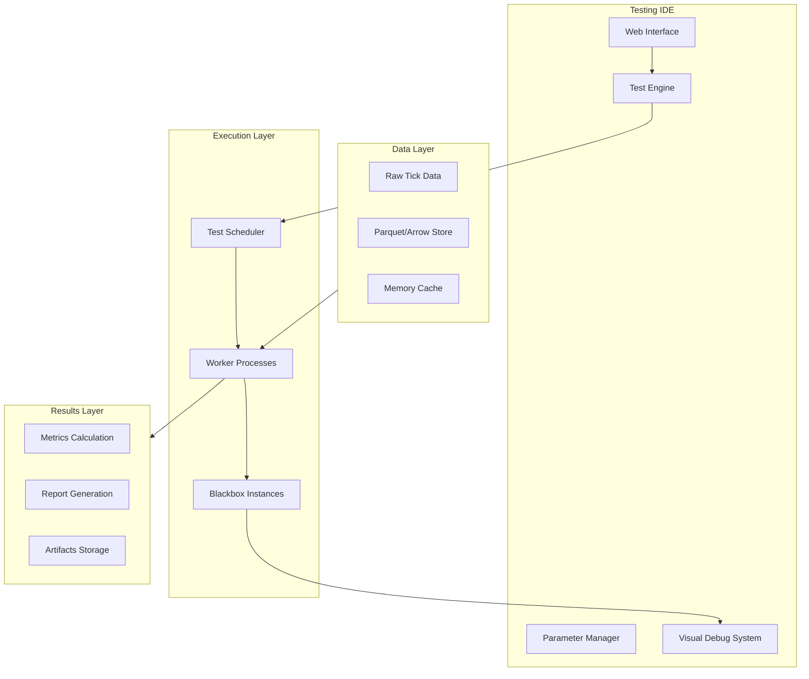

# FinexTestingIDE - Komplette Dokumentation v2.0

## Inhaltsverzeichnis

1. [Vision & Ziele](#vision--ziele)
2. [Architektur-Überblick](#architektur-überblick)
3. [Blackbox-Framework](#blackbox-framework)
4. [Daten-Pipeline](#daten-pipeline)
5. [Testing-Engine](#testing-engine)
6. [Parameter-System](#parameter-system)
7. [Visual Debug System](#visual-debug-system)
8. [Standard-Indikatoren](#standard-indikatoren)
9. [Implementierungs-Roadmap](#implementierungs-roadmap)
10. [Code-Beispiele](#code-beispiele)
11. [Deployment & Skalierung](#deployment--skalierung)
12. [SaaS-Vision](#saas-vision)

---

## Vision & Ziele

### Kernvision

**FinexTestingIDE** ist eine hochperformante IDE-artige Forschungs- und Testumgebung, die **Strategie-Code**, **Marktdaten** und **Metriken** in einem orchestrierten Flow zusammenführt. Das Ziel: Trading-Forschung **reproduzierbar**, **ehrlich vergleichbar** und **operativ verwertbar** machen – vom ersten Prototyp bis zum dokumentierten, live-ready Ergebnis.

### Kernprinzipien

- **Radikale Transparenz** dort, wo sie nützt
- **Strikte IP-Kapselung** durch Blackbox-API
- **Massive Parallelisierung** (1000+ Szenarien gleichzeitig)
- **Deterministische Reproduzierbarkeit** (fixe Seeds, explizite Annahmen)
- **Nahtloser Handover** zu Live-Trading-Systemen

### Besonderheit: Strategie-Blackbox-API

Die **Blackbox-API** ermöglicht es, Strategien als **undurchsichtige, aber testbare** Module zu betreiben. Was „hinter" der Blackbox passiert, bleibt geheim – entscheidend ist nur der **stabile Vertrag** zwischen IDE und Strategie.

**Warum das revolutionär ist:**
- **IP-Schutz:** Algorithmus-Interna bleiben geschützt
- **Fairer Vergleich:** Identische Test-Bedingungen für alle Strategien
- **Debug optional:** Entwicklungs-Transparenz vs. Production-Sicherheit
- **Plug & Play:** Einmal entwickelt, überall einsetzbar

---

## Architektur-Überblick

### High-Level Komponenten



### Technologie-Stack (MVP)

**Core Engine:**
- **Python 3.11+** (Performance + Ecosystem)
- **Apache Arrow/Parquet** (Zero-copy Daten)
- **multiprocessing** (Echte Parallelität, kein GIL)

**Storage:**
- **Parquet-Files** (Komprimierte Spalten-Storage)
- **Memory-Mapping** (Zero-copy Zugriff)
- **Optional: ClickHouse** (Bei TB+ Datenmengen)

**Communication:**
- **Shared Memory** (Arrow-Buffers zwischen Prozessen)
- **multiprocessing.Queue** (Event-Passing)
- **Optional: gRPC** (Distributed/Multi-Language)

---

## Blackbox-Framework

### Konzept

Jede Trading-Strategie ist eine **Blackbox** mit einem definierten Interface. Die IDE kennt nur die **Eingaben** und **Ausgaben**, nicht die interne Logik.

### Minimaler Vertrag (I/O)

**Eingaben (IDE → Blackbox):**
```json
{
  "type": "tick",
  "timestamp": "2024-01-15T14:23:45.123456Z",
  "symbol": "EURUSD",
  "bid": 1.08945,
  "ask": 1.08947,
  "volume": 1000000,
  "spread_points": 2,
  "env": {
    "mode": "debug|production",
    "seed": 42
  }
}
```

**Ausgaben (Blackbox → IDE):**
```json
{
  "signal": "BUY|SELL|FLAT",
  "price": 1.08947,
  "quantity": 1.0,
  "confidence": 0.85,
  "risk": {
    "stop_loss": 1.08900,
    "take_profit": 1.09000
  },
  "meta": {
    "indicators": {
      "macd": 0.0012,
      "rsi": 65.3
    },
    "debug_visuals": [...]
  }
}
```

**Wichtig:** `meta` wird in Production-Mode komplett unterdrückt (IP-Schutz).

### Framework-Implementierung

Das Framework bietet eine **Base-Klasse** mit allen Standard-Features:

```python
class BlackboxBase(ABC):
    def __init__(self, debug_enabled: bool = True):
        self.debug_enabled = debug_enabled
        self.parameters = {}
        self.price_history = deque(maxlen=1000)
        self.visual_elements = []
        self.indicators = IndicatorLibrary()
    
    @abstractmethod
    def get_parameter_schema(self) -> Dict[str, Dict]:
        """Parameter-Definition für automatische UI-Generierung"""
        pass
    
    @abstractmethod  
    def on_tick(self, tick: Tick) -> Signal:
        """Haupt-Trading-Logik"""
        pass
```

**Entwickler müssen nur 2 Methoden implementieren:**
1. `get_parameter_schema()` – Parameter-Definition
2. `on_tick()` – Trading-Logik

Alles andere (Debug-Visuals, Parameter-Validierung, etc.) ist automatisch verfügbar.

---

## Daten-Pipeline

### Tick-Datenstruktur

**Von MQL5/MetaTrader erfasst:**
```json
{
  "symbol": "EURUSD",
  "timestamp": "2024-01-15T14:23:45.123456Z",
  "bid": 1.08945,
  "ask": 1.08947,
  "volume": 1000000,
  "spread_points": 2,
  "spread_pct": 0.00183,
  "market_info": {
    "session": "london",
    "liquidity": "high"
  }
}
```

### Datenmenge-Schätzung

**Pro Major-Pair (EURUSD) pro Tag:**
- Aktive Stunden: ~16h (überlappende Sessions)
- Ticks/Sekunde: 10-50 (volatilitäts-abhängig)
- Rohdaten: 230MB - 1.15GB/Tag
- Komprimiert (Parquet): ~23-115MB/Tag

**100 Test-Szenarien, 30 Tage:**
- Rohdaten: ~34.5TB
- Parquet-komprimiert: ~3.45TB
- Arrow-optimiert: **~1.7TB** (final)

### Storage-Architektur

```
datasets/
├── raw/                    # MQL5 Raw-Export
│   ├── EURUSD_20240101.json
│   └── GBPUSD_20240101.json
├── processed/              # Parquet-Optimiert
│   ├── EURUSD/
│   │   ├── 2024Q1_M1.parquet
│   │   └── 2024Q1_ticks.parquet
│   └── metadata/
│       ├── schemas.json
│       └── indices.json
└── cache/                  # Memory-mapped Cache
    ├── shared_buffers/
    └── worker_cache/
```

---

## Testing-Engine

### Parallelisierung-Konzept

**Problem:** 100+ Szenarien gleichzeitig testen ohne Performance-Verlust

**Lösung:** Process-based Parallelität mit Shared Memory

```python
# Vereinfachtes Konzept
class TestEngine:
    def run_scenarios(self, scenarios: List[TestScenario]):
        # 1. Alle Daten in Shared Memory laden
        shared_data = self.load_to_shared_memory(scenarios)
        
        # 2. Worker-Prozesse starten (kein GIL!)
        with ProcessPoolExecutor(max_workers=cpu_count()) as executor:
            futures = []
            for scenario in scenarios:
                future = executor.submit(
                    run_single_scenario,
                    scenario.blackbox_class,
                    scenario.parameters,
                    shared_data
                )
                futures.append(future)
        
        # 3. Ergebnisse sammeln
        results = [f.result() for f in futures]
        return self.aggregate_results(results)
```

**Warum Prozesse statt Threads?**
- **Threads:** Teilen RAM, aber Python GIL = nur 1 Thread rechnet
- **Prozesse:** Eigener RAM, echte Parallelität, aber Shared Memory für gemeinsame Daten

### Determinismus-Garantie

Jeder Test-Run ist **100% reproduzierbar**:
- **Master-Seed** → abgeleitete Seeds pro Worker
- **Fixierte Dataset-Snapshots** (versioniert mit Hash)
- **Identische Parameter** und Umgebungseinstellungen
- **Deterministic Scheduling** (Worker-Reihenfolge egal)

---

## Parameter-System

### Schema-Definition

Jede Blackbox definiert ihre Parameter **deklarativ**:

```python
def get_parameter_schema(self):
    return {
        'macd_fast': {
            'type': 'int',
            'default': 12,
            'min_val': 5,
            'max_val': 50,
            'description': 'MACD Fast EMA Periode',
            'category': 'MACD Settings'
        },
        'stop_loss_atr': {
            'type': 'float',
            'default': 2.0,
            'min_val': 1.0,
            'max_val': 10.0,
            'description': 'Stop Loss als ATR-Vielfaches',
            'category': 'Risk Management'
        }
    }
```

### Automatische Validierung

Das Framework validiert **automatisch**:
- **Typ-Checks** (int, float, bool, string)
- **Wertebereich** (min/max Validierung)
- **Required vs. Optional** Parameter

### Parameter-Abhängigkeiten (Future)

Für später geplant: **Smart Parameter Dependencies**

```yaml
dependencies:
  - rule: "macd_fast >= macd_slow"
    error: "Fast Period muss kleiner als Slow Period sein"
  
  - rule: "envelope_deviation < 1.5"
    suggestion:
      stop_loss_atr: 1.5
      reason: "Bei engen Envelopes sollte SL enger sein"
```

---

## Visual Debug System

### Konzept

**Entwicklung:** Vollständige Transparenz – jeder Indikator, jede Berechnung wird visualisiert  
**Production:** Totale Stille – keine Debug-Ausgaben, kein IP-Leak

### Visual-Typen

**1. Linien (Indikatoren)**
```python
# In Blackbox
self.add_line_point("macd_line", macd_value, tick.timestamp)
self.add_line_point("signal_line", signal_value, tick.timestamp)
```

**2. Pfeile (Signale)**
```python
# Buy/Sell Signale
self.add_arrow("up", tick.price, tick.timestamp, "MACD Bullish Cross")
self.add_arrow("down", tick.price, tick.timestamp, "RSI Overbought")
```

**3. Zonen (Future)**
```python
# Support/Resistance, Bollinger Bands
self.add_zone("bollinger_band", start_time, end_time, upper_price, lower_price)
```

### IDE-Rendering

Die IDE rendert alle Debug-Daten **automatisch**:
- **Haupt-Chart:** Candlestick-Chart mit Preis-Aktion
- **Indikator-Overlays:** MACD, RSI, Bollinger als Linien
- **Signal-Marker:** Buy/Sell-Pfeile an entsprechenden Stellen
- **Interactive:** Zoom, Pan, Hover-Details

### Production-Sicherheit

```python
if self.mode == "production":
    # Alle Debug-Funktionen sind No-Ops
    debug_enabled = False
    # meta-Feld in Signals bleibt leer
    return Signal("BUY", meta={})  # Leeres meta!
```

---

## Standard-Indikatoren

### Verfügbare Indikatoren (MVP)

Das Framework enthält bereits die **wichtigsten Standard-Indikatoren**:

**1. Simple Moving Average (SMA)**
```python
sma_20 = self.indicators.sma(prices, period=20)
```

**2. Relative Strength Index (RSI)**
```python
rsi = self.indicators.rsi(prices, period=14)
if rsi > 70:  # Overbought
    return Signal("SELL")
```

**3. MACD**
```python
macd_line, signal_line, histogram = self.indicators.macd(
    prices, fast=12, slow=26, signal=9
)
```

**4. Bollinger Bands**
```python
upper, middle, lower = self.indicators.bollinger_bands(
    prices, period=20, std_dev=2.0
)
```

### Erweiterbarkeit

Neue Indikatoren sind **trivial hinzuzufügen**:

```python
class IndicatorLibrary:
    @staticmethod
    def stochastic(high_prices, low_prices, close_prices, k_period=14):
        # Implementierung
        return k_percent, d_percent
    
    @staticmethod
    def atr(high_prices, low_prices, close_prices, period=14):
        # Average True Range
        return atr_value
```

---

## Implementierungs-Roadmap

### Phase 1: MVP (4-6 Wochen)

**Woche 1-2: Core Framework**
- ✅ Blackbox Base-Klasse
- ✅ Parameter-System mit Validierung
- ✅ Standard-Indikatoren (RSI, MACD, Bollinger)
- ✅ Simple Test-Engine

**Woche 3-4: Daten-Pipeline**
- 🔄 MQL5 → JSON Exporter
- 🔄 JSON → Parquet Converter
- 🔄 Memory-mapped Data Loader
- 🔄 Shared Memory für Worker

**Woche 5-6: Testing & UI**
- 🔄 Multi-Process Test-Engine
- 🔄 Basic Web-UI (Streamlit/Dash)
- 🔄 Chart-Rendering mit Debug-Visuals
- 🔄 Parameter-Eingabe Interface

### Phase 2: Scale-Up (6-8 Wochen)

**Performance & Skalierung:**
- Distributed Testing (Redis/Queue)
- Advanced Memory Management
- Caching & Optimization
- Load Balancing

**Advanced Features:**
- Parameter-Abhängigkeiten UI
- Erweiterte Visual-Types
- Batch-Testing Interface
- Report-Generation

### Phase 3: Production-Ready (4-6 Wochen)

**Security & Compliance:**
- Blackbox Obfuscation/Compilation
- Production vs. Debug Modi
- Audit-Logging
- User Management

**SaaS-Vorbereitung:**
- Multi-Tenancy
- Token-basierte Abrechnung
- Cloud-Deployment
- Monitoring & Alerting

---

## Code-Beispiele

### Beispiel 1: Einfache MACD-Strategie

```python
class MACDStrategy(BlackboxBase):
    def get_parameter_schema(self):
        return {
            'fast_period': {
                'type': 'int',
                'default': 12,
                'min_val': 5,
                'max_val': 50,
                'description': 'MACD Fast EMA Period'
            },
            'slow_period': {
                'type': 'int',
                'default': 26, 
                'min_val': 10,
                'max_val': 100,
                'description': 'MACD Slow EMA Period'
            },
            'signal_threshold': {
                'type': 'float',
                'default': 0.0001,
                'min_val': 0.0,
                'max_val': 0.01,
                'description': 'Signal Threshold'
            }
        }
    
    def on_tick(self, tick: Tick) -> Signal:
        self.price_history.append(tick.mid_price)
        
        if len(self.price_history) < self.parameters['slow_period']:
            return Signal("FLAT")
        
        # MACD berechnen
        macd_line, _, _ = self.indicators.macd(
            list(self.price_history),
            self.parameters['fast_period'],
            self.parameters['slow_period']
        )
        
        # Debug-Visualisierung
        self.add_line_point("macd_line", macd_line, tick.timestamp)
        
        # Trading-Logik
        threshold = self.parameters['signal_threshold']
        
        if macd_line > threshold:
            self.add_arrow("up", tick.mid_price, tick.timestamp, "MACD Buy")
            return Signal("BUY", price=tick.ask)
        elif macd_line < -threshold:
            self.add_arrow("down", tick.mid_price, tick.timestamp, "MACD Sell") 
            return Signal("SELL", price=tick.bid)
        
        return Signal("FLAT")
```

### Beispiel 2: Test ausführen

```python
# Test-Setup
engine = SimpleTestEngine()

# Sample Tick-Data (normalerweise aus Parquet)
sample_ticks = [
    {
        'symbol': 'EURUSD',
        'timestamp': '2024-01-01T10:00:00Z',
        'bid': 1.0894,
        'ask': 1.0896,
        'volume': 1000,
        'spread_points': 2
    },
    # ... weitere Ticks
]

# Parameter-Set
macd_params = {
    'fast_period': 12,
    'slow_period': 26, 
    'signal_threshold': 0.0001
}

# Test ausführen
results = engine.run_test(MACDStrategy, sample_ticks, macd_params)

print(f"Generierte Signale: {len(results['signals'])}")
print(f"Debug-Visuals: {len(results['debug_visuals'])}")

# Ergebnisse enthalten:
# - results['signals']: Alle Trading-Signale
# - results['debug_visuals']: Alle Chart-Overlays
# - results['parameters']: Verwendete Parameter
```

---

## Deployment & Skalierung

### Hardware-Anforderungen (100+ parallele Tests)

**Minimum-Setup:**
- **CPU:** 16+ Cores (AMD Ryzen/Intel Core)
- **RAM:** 64GB (Shared Memory für Daten)
- **Storage:** 2TB NVMe SSD
- **Network:** Nicht kritisch (alles lokal)

**Production-Setup:**
- **CPU:** 32+ Cores (AMD EPYC, Intel Xeon)
- **RAM:** 128+ GB
- **Storage:** 5TB+ NVMe (RAID-1)
- **Backup:** 10TB+ Cold Storage

### Skalierung-Strategien

**Vertikal (Scale-Up):**
- Mehr CPU-Cores pro Server
- Mehr RAM für größere Datasets
- Schnellerer Storage (NVMe → Optane)

**Horizontal (Scale-Out):**
- Distributed Queue (Redis/Kafka)
- Worker-Nodes via Docker/Kubernetes
- Shared Storage (NFS/S3)

---

## SaaS-Vision

### FINEXplatform - Cloud Service

**Vision:** FinexTestingIDE als **Multi-Tenant SaaS** mit **Token-basierter Abrechnung**

### Wertversprechen

- **Sofort loslegen:** Keine Server-Verwaltung
- **Elastic Scaling:** Von 1 bis 1000+ Tests on-demand
- **Kostenkontrolle:** Pay-as-you-go mit Budget-Limits
- **Enterprise-Security:** EU-Datenhaltung, DSGVO-konform

### Token-Abrechnungsmodell

**Compute Unit (CU) Definition:**
```
CU = vCPU_minutes 
   + α × RAM_GB_minutes 
   + β × IO_GB 
   + γ × GPU_minutes
```

**Preismodell-Beispiele:**
- **Free Trial:** 50 Tokens/Tag, Preemptible-only
- **Pro:** 1,000 Tokens/Tag, Standard-Worker
- **Team:** 5,000 Tokens/Tag, Dedicated Pools
- **Enterprise:** Custom, Private Clusters

### Compliance & Sicherheit

- **Data Residency:** Standard EU, weitere Regionen optional
- **Encryption:** TLS + KMS-managed Keys
- **Audit Logs:** Unveränderbare Compliance-Logs
- **DSGVO:** Right-to-erasure, Datenportabilität

### Roadmap

**2024 Q3:** MVP Launch (Local/Single-Tenant)
**2024 Q4:** Multi-Tenant Beta
**2025 Q1:** Public SaaS Launch
**2025 Q2:** Enterprise Features (SSO, BYOK)

---

## Fazit

Die **FinexTestingIDE** löst ein fundamentales Problem in der Trading-Entwicklung: **Wie teste ich Strategien schnell, fair und reproduzierbar, ohne IP preiszugeben?**

### Kernvorteile

✅ **IP-Schutz durch Blackbox-API** – Algorithmus bleibt geheim  
✅ **Massive Parallelisierung** – 1000+ Tests gleichzeitig  
✅ **Reproduzierbare Ergebnisse** – Deterministische Seeds & Snapshots  
✅ **Developer Experience** – Visual Debug + Parameter-Management  
✅ **Production-Ready** – Nahtloser Übergang zu Live-Trading  
✅ **Skalierbar** – MVP → SaaS-Platform  

### Competitive Advantage

**Kein anderes Tool bietet:**
- Blackbox-API mit Debug-Transparenz UND IP-Schutz
- Massive Parallelisierung mit Zero-Copy Memory-Sharing
- Automatische Parameter-UI-Generierung aus Code
- Production/Debug-Mode für nahtlosen Deployment

Die **FinexTestingIDE** wird der **neue Standard** für professionelle Trading-Forschung.

---

**Dokumentation Version:** 2.0  
**Erstellt:** Januar 2025  
**Status:** MVP Implementation Phase  
**Nächste Review:** Nach Phase 1 Completion

---

### Anhang: Schnellstart

**1. Repository klonen und Setup:**
```bash
git clone https://github.com/your-org/finex-testing-ide
cd finex-testing-ide
pip install -r requirements.txt
```

**2. Erste Strategie erstellen:**
```python
# my_strategy.py
from blackbox_framework import BlackboxBase, Signal

class MyStrategy(BlackboxBase):
    def get_parameter_schema(self):
        return {
            'rsi_period': {
                'type': 'int', 
                'default': 14,
                'description': 'RSI Lookback Period'
            }
        }
    
    def on_tick(self, tick):
        # Ihre Trading-Logik hier
        return Signal("FLAT")
```

**3. Test ausführen:**
```python
from test_engine import SimpleTestEngine
from my_strategy import MyStrategy

engine = SimpleTestEngine()
results = engine.run_test(MyStrategy, tick_data, {'rsi_period': 14})
print(f"Signale: {len(results['signals'])}")
```

**Das war's!** Sie haben Ihre erste Blackbox-Strategie erstellt und getestet. 🚀