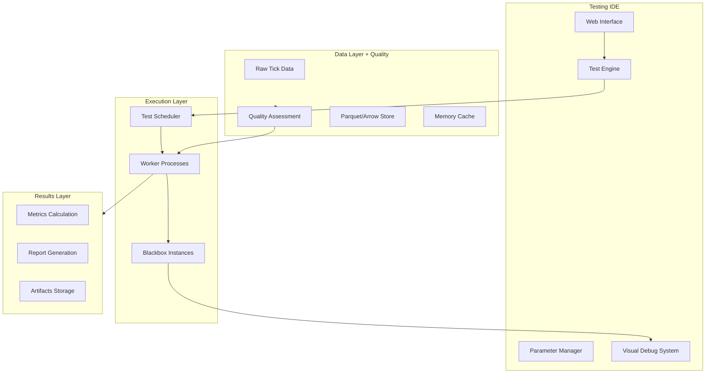

# FiniexTestingIDE - Komplette Dokumentation v2.1

## Inhaltsverzeichnis

1. [Vision & Ziele](#vision--ziele)
2. [Architektur-Überblick](#architektur-überblick)
3. [**Data Quality & Error Management** ⭐](#data-quality--error-management)
4. [**Enhanced Daten-Pipeline** ⭐](#enhanced-daten-pipeline)
5. [Blackbox-Framework (Konzept)](#blackbox-framework-konzept)
6. [Testing-Engine (Planung)](#testing-engine-planung)
7. [Parameter-System (Konzept)](#parameter-system-konzept)
8. [Visual Debug System (Konzept)](#visual-debug-system-konzept)
9. [Standard-Indikatoren (Planung)](#standard-indikatoren-planung)
10. [Implementierungs-Roadmap](#implementierungs-roadmap)
11. [Code-Beispiele (Konzeptionell)](#code-beispiele-konzeptionell)
12. [Deployment & Skalierung](#deployment--skalierung)
13. [SaaS-Vision](#saas-vision)

*⭐ = Implementiert/Detailliert dokumentiert*

---

## Vision & Ziele

### Kernvision

**FiniexTestingIDE** ist eine hochperformante IDE-artige Forschungs- und Testumgebung, die **Strategie-Code**, **Marktdaten** und **Metriken** in einem orchestrierten Flow zusammenführt. Das Ziel: Trading-Forschung **reproduzierbar**, **ehrlich vergleichbar** und **operativ verwertbar** machen – vom ersten Prototyp bis zum dokumentierten, live-ready Ergebnis.

### Kernprinzipien

- **Radikale Transparenz** dort, wo sie nützt
- **Strikte IP-Kapselung** durch Blackbox-API
- **Massive Parallelisierung** (1000+ Szenarien gleichzeitig)
- **Deterministische Reproduzierbarkeit** (fixe Seeds, explizite Annahmen)
- **Realistische Testbedingungen** durch intelligente Datenqualitätssicherung
- **Nahtloser Handover** zu Live-Trading-Systemen

### Besonderheit: Strategie-Blackbox-API

Die **Blackbox-API** ermöglicht es, Strategien als **undurchsichtige, aber testbare** Module zu betreiben. Was „hinter" der Blackbox passiert, bleibt geheim – entscheidend ist nur der **stabile Vertrag** zwischen IDE und Strategie.

**Warum das revolutionär ist:**
- **IP-Schutz:** Algorithmus-Interna bleiben geschützt
- **Fairer Vergleich:** Identische Test-Bedingungen für alle Strategien
- **Debug optional:** Entwicklungs-Transparenz vs. Production-Sicherheit
- **Plug & Play:** Einmal entwickelt, überall einsetzbar

---

## Architektur-Überblick

### High-Level Komponenten



### Implementierungsstand

**Implementiert/Produktionsreif:**
- **Daten-Pipeline**: MQL5 → JSON → Python → Parquet mit Quality-Framework
- **Error-Management**: 3-Level Fehlerklassifizierung und Market-Authenticity-Detection
- **Data Loading**: Quality-aware Parquet-Loader mit Multi-Mode-Support

**Konzeptionell/In Planung:**
- **Blackbox-Framework**: Base-Klassen und Interface definiert
- **Testing-Engine**: Parallelisierungs-Architektur spezifiziert
- **Web-Interface**: UI-Mockups und API-Design vorhanden
- **Parameter-System**: Schema-Format konzipiert

---

## Data Quality & Error Management ⭐

### Das revolutionäre Qualitäts-Paradigma

**Problem**: Traditionelle Backtesting-Systeme behandeln alle "Fehler" gleich und filtern wichtige Marktinformationen heraus.

**FiniexTestingIDE Lösung**: Intelligente Unterscheidung zwischen **markt-authentischen Anomalien** und **system-bedingten Fehlern**.

#### Markt-authentische Anomalien (Qualitätsmerkmal)
**Definition:** Echte Marktphänomene, die auch im Live-Trading auftreten
- Spread-Sprünge bei News-Events (14:30 UTC, 08:30 UTC)
- Liquiditätslücken zwischen Trading-Sessions  
- Volatilitäts-bedingte Preis-Anomalien
- Session-Übergangs-Artefakte

**Behandlung:** Behalten für realistische Testbedingungen

#### System-bedingte Fehler (Datenqualitäts-Problem)
**Definition:** Technische Artefakte ohne Marktrelevanz
- Netzwerk-Unterbrechungen außerhalb Handelszeiten
- PC-Performance-Probleme (Zeitregressionen)
- Feed-Korruption (unmögliche Spreads, negative Preise)
- Broker-Connection-Issues

**Behandlung:** Identifizieren, warnen, optional filtern

### Gestuftes Error-Classification-System

**NEGLIGIBLE (Vernachlässigbar)** - Severity Level 0
- Spread-Sprünge <50% (normale Volatilität)
- Kleine Datenlücken 60-300s (Session-Übergänge)
- Fehlende Tick-Flags (broker-spezifisch)
- **Status**: Daten voll brauchbar

**SERIOUS (Ernst)** - Severity Level 1  
- Extreme Spreads >5% (ungewöhnliche Bedingungen)
- Große Datenlücken >5min (Verbindungsprobleme)
- Preis-Sprünge >10% (potentielle Feed-Issues)
- **Status**: Daten brauchbar mit Einschränkungen

**FATAL (Fatal)** - Severity Level 2
- Negative Preise, invertierte Spreads
- Zeitregressionen (unmögliche Zeitfolgen)
- Korrupte Datenstrukturen
- **Status**: Daten womöglich unbrauchbar

### Qualitäts-Scoring-System

**Automatische Berechnung von drei Qualitäts-Scores:**

```javascript
overall_quality_score = 1.0 - (total_errors / total_ticks)
data_integrity_score = 1.0 - (fatal_errors / total_ticks)  
data_reliability_score = 1.0 - ((serious_errors + fatal_errors) / total_ticks)
```

**Interpretation:**
- Score >95%: Ausgezeichnete Qualität
- Score 85-95%: Gute Qualität, mit Vorsicht verwenden
- Score 70-85%: Mäßige Qualität, Review empfohlen
- Score <70%: Schlechte Qualität, nicht für kritische Tests verwenden

---

## Enhanced Daten-Pipeline ⭐

### Vollständig implementierter Workflow

**MQL5 Expert Advisor → JSON-Files → Python Converter → Parquet-Database → Testing IDE**

#### Phase 1: TickCollector v1.03 (MQL5)

**Revolutionäre Features:**
- **Echtzeit-Error-Classification** während Live-Sammlung
- **Adaptive Symbol-Konfiguration** (Major vs. Exotic Pairs)
- **Configurable Validation Thresholds** pro Trading-Pair
- **Stream Health Monitoring** mit Korruptions-Erkennung
- **Intelligent Recommendations** basierend auf Error-Patterns

**Tick-basierte File-Rotation:**
- 50.000 Ticks pro JSON-File (nahtloser Übergang)
- Gleichmäßige Dateigrößen für optimierte Pipeline-Performance

**Erwartete Dateigrößen pro 50k-Tick-File:**
```
EURUSD: 18-25 MB (8-15 Files/Tag)
GBPUSD: 20-28 MB (6-12 Files/Tag)
USDJPY: 15-22 MB (5-10 Files/Tag)  
AUDUSD: 16-24 MB (4-8 Files/Tag)
```

#### Phase 2: Quality-Aware Import (Python)

**Pre-Import Health Assessment:**
- Automatische Error-Rate-Analyse
- Pattern-Recognition für Market vs. System Anomalies
- Multi-Symbol-Korrelations-Checks
- Intelligent Import-Decision-Logic

**Import-Threshold-Management:**
```
Quality >95%: Automatic Import
Quality 85-95%: Import mit Warning
Quality 70-85%: Manual Review empfohlen  
Quality <70%: Import-Ablehnung vorgeschlagen
```

#### Phase 3: Enhanced Parquet Storage

**Quality-Metadata-Integration:**
Jede Parquet-File enthält vollständige Qualitätsinformationen als Metadaten.

**Optimierte Kompression:**
- JSON → Parquet: 8-12:1 Compression Ratio
- Column-Store-Optimierung für selective Loading
- Memory-Mapping für Zero-Copy Multi-Process-Access

#### Phase 4: Multi-Mode Data Loading

**Drei Testing-Modi für verschiedene Anwendungsfälle:**

**Clean Mode**: System-Errors gefiltert, minimale Anomalien
- Für Algorithmus-Development und schnelle Iteration
- Quality Threshold: >99%

**Realistic Mode**: Markt-Anomalien behalten, System-Errors gefiltert
- Für echte Robustness-Tests und Pre-Production-Validation
- Quality Threshold: >85%

**Raw Mode**: Alle Daten ungefiltert
- Für Extreme-Stress-Testing und System-Robustness
- Quality Threshold: >70%

### Robustness-Testing-Framework

**Dual-Condition Strategy Validation:**

1. **Clean Conditions Test** - Theoretisches Performance-Maximum
2. **Realistic Conditions Test** - Erwartbare Live-Performance

**Robustness Score Calculation:**
```
Robustness Score = Realistic Performance / Clean Performance

>0.9: Sehr robuste Strategie (live-ready)
0.7-0.9: Mäßig robust (weitere Tests empfohlen)
<0.7: Fragile Strategie (Überarbeitung nötig)
```

---

## Blackbox-Framework (Konzept)

### Minimaler Vertrag (I/O-Definition)

**Eingaben (IDE → Blackbox):**
```json
{
  "type": "tick",
  "timestamp": "2024-01-15T14:23:45.123456Z",
  "symbol": "EURUSD",
  "bid": 1.08945,
  "ask": 1.08947,
  "volume": 1000000,
  "spread_points": 2,
  "env": {
    "mode": "debug|production",
    "seed": 42
  }
}
```

**Ausgaben (Blackbox → IDE):**
```json
{
  "signal": "BUY|SELL|FLAT",
  "price": 1.08947,
  "quantity": 1.0,
  "confidence": 0.85,
  "risk": {
    "stop_loss": 1.08900,
    "take_profit": 1.09000
  },
  "meta": {
    "indicators": {
      "macd": 0.0012,
      "rsi": 65.3
    },
    "debug_visuals": [...]
  }
}
```

### Framework-Implementierung (Geplant)

**Base-Klasse-Konzept:**
```python
class BlackboxBase(ABC):
    @abstractmethod
    def get_parameter_schema(self) -> Dict[str, Dict]:
        """Parameter-Definition für automatische UI-Generierung"""
        pass
    
    @abstractmethod  
    def on_tick(self, tick: Tick) -> Signal:
        """Haupt-Trading-Logik"""
        pass
```

**Implementierungsstatus:** Konzeptionell definiert, Prototyp in Entwicklung

---

## Testing-Engine (Planung)

### Parallelisierungs-Konzept

**Problem:** 100+ Szenarien gleichzeitig testen ohne Performance-Verlust

**Lösungsansatz:** Process-based Parallelität mit Shared Memory
- Prozesse statt Threads (umgeht Python GIL)
- Shared Memory für Arrow-Buffers (Zero-Copy Data Access)
- Worker-Pool-Management mit Load-Balancing

### Determinismus-Garantie

**Reproduzierbarkeit durch:**
- Master-Seed → abgeleitete Seeds pro Worker
- Fixierte Dataset-Snapshots (versioniert mit Hash)
- Identische Parameter und Umgebungseinstellungen
- Deterministic Scheduling

**Implementierungsstatus:** Architektur definiert, Prototyping-Phase

---

## Parameter-System (Konzept)

### Schema-Definition

**Deklarative Parameter-Spezifikation:**
```python
def get_parameter_schema(self):
    return {
        'macd_fast': {
            'type': 'int',
            'default': 12,
            'min_val': 5,
            'max_val': 50,
            'description': 'MACD Fast EMA Periode',
            'category': 'MACD Settings'
        }
    }
```

### Automatische Validierung

**Framework validiert automatisch:**
- Typ-Checks (int, float, bool, string)
- Wertebereich (min/max Validierung)
- Required vs. Optional Parameter

**Implementierungsstatus:** Schema-Format definiert, Validator-Logik geplant

---

## Visual Debug System (Konzept)

### Dual-Mode-Konzept

**Entwicklung:** Vollständige Transparenz – jeder Indikator visualisiert  
**Production:** Totale Stille – keine Debug-Ausgaben, kein IP-Leak

### Visual-Typen (Geplant)

**Linien-Overlays:**
```python
self.add_line_point("macd_line", macd_value, tick.timestamp)
```

**Signal-Marker:**
```python
self.add_arrow("up", tick.price, tick.timestamp, "MACD Bullish Cross")
```

**Zonen-Highlighting:**
```python
self.add_zone("bollinger_band", start_time, end_time, upper, lower)
```

**Implementierungsstatus:** Konzept definiert, UI-Framework noch nicht implementiert

---

## Standard-Indikatoren (Planung)

### Geplante Indikator-Bibliothek

**MVP-Indikatoren:**
- Simple Moving Average (SMA)
- Relative Strength Index (RSI)
- MACD (Moving Average Convergence Divergence)
- Bollinger Bands
- Average True Range (ATR)

**Erweiterte Indikatoren (Future):**
- Stochastic Oscillator
- Ichimoku Cloud
- Fibonacci Retracements
- Volume Weighted Average Price (VWAP)

**Implementierungsstatus:** Interface definiert, Implementierung ausstehend

---

## Implementierungs-Roadmap

### Phase 1: MVP Foundation (4-6 Wochen) - **IN PROGRESS**

**✅ Abgeschlossen:**
- Enhanced MQL5 Data Pipeline mit Quality-Framework
- JSON → Parquet Converter mit Health-Checks
- Quality-Aware Data Loader
- Error-Classification-System

**🔄 In Arbeit:**
- Blackbox Base-Framework
- Basic Parameter-System
- Simple Test-Engine Prototyp

**📋 Geplant:**
- Standard-Indikatoren-Implementierung
- Basic Web-UI (Streamlit/Dash)

### Phase 2: Core Testing Engine (6-8 Wochen)

**Geplant:**
- Multi-Process Test-Engine
- Shared Memory Data Access
- Advanced Parameter-UI
- Chart-Rendering mit Debug-Visuals
- Robustness-Testing-Framework

### Phase 3: Production Features (4-6 Wochen)

**Geplant:**
- Blackbox Obfuscation/Compilation
- Production vs. Debug Modi
- Advanced Web-Interface
- Report-Generation-System
- User Management & Security

### Phase 4: Scale-Up & SaaS (8-10 Wochen)

**Geplant:**
- Distributed Testing (Cloud)
- Multi-Tenancy
- Advanced Monitoring
- Enterprise Security Features

---

## Code-Beispiele (Konzeptionell)

### Beispiel: MACD-Strategie (Geplant)

```python
class MACDStrategy(BlackboxBase):
    def get_parameter_schema(self):
        return {
            'fast_period': {'type': 'int', 'default': 12, 'min_val': 5, 'max_val': 50},
            'slow_period': {'type': 'int', 'default': 26, 'min_val': 10, 'max_val': 100},
            'signal_threshold': {'type': 'float', 'default': 0.0001, 'min_val': 0.0}
        }
    
    def on_tick(self, tick: Tick) -> Signal:
        # MACD-Logik hier
        # Debug-Visualisierung (nur Development-Mode)
        if self.debug_enabled:
            self.add_line_point("macd_line", macd_value, tick.timestamp)
        
        return Signal("BUY" if macd_value > threshold else "FLAT")
```

### Beispiel: Quality-Aware Testing

```python
# Realistische Test-Bedingungen
engine = TestEngine(mode="realistic", quality_threshold=0.85)
results = engine.run_test(MACDStrategy, tick_data, parameters)

print(f"Strategy Performance: {results['sharpe_ratio']}")
print(f"Data Quality Score: {results['data_context']['quality_score']}")
print(f"Robustness Score: {results['robustness_metrics']['overall_robustness']}")
```

---

## Deployment & Skalierung

### Hardware-Anforderungen

**Development (Single Developer):**
- CPU: 8-16 Cores (AMD Ryzen 7/9)
- RAM: 32-64 GB
- Storage: 1TB NVMe SSD

**Production (100+ parallele Tests):**
- CPU: 32+ Cores (AMD EPYC, Intel Xeon)
- RAM: 128+ GB
- Storage: 5TB+ NVMe (RAID-1)

### Skalierungs-Strategien

**Vertikal:** Mehr CPU-Cores, RAM, schnellerer Storage
**Horizontal:** Distributed Queue (Redis), Worker-Nodes (Docker/Kubernetes)

---

## SaaS-Vision

### FINIEXplatform - Cloud Service (Future)

**Vision:** FiniexTestingIDE als Multi-Tenant SaaS mit Token-basierter Abrechnung

**Wertversprechen:**
- Sofort loslegen ohne Server-Verwaltung
- Elastic Scaling von 1 bis 1000+ Tests
- Pay-as-you-go mit Budget-Limits
- Enterprise-Security & EU-DSGVO-Compliance

**Roadmap:**
- 2024 Q4: MVP Launch (Local/Single-Tenant)
- 2025 Q1: Multi-Tenant Beta
- 2025 Q2: Public SaaS Launch
- 2025 Q3: Enterprise Features

---

## Fazit

Die **FiniexTestingIDE** revolutioniert Trading-Strategy-Development durch:

**✅ Implementiert:**
- Intelligente Datenqualitätssicherung mit Market-Authenticity-Detection
- Robuste MQL5 → Parquet Pipeline mit 3-Level Error-Classification  
- Quality-Aware Data Loading mit Multi-Mode-Support
- Realistische Test-Bedingungen durch authentische Markt-Anomalien

**📋 In Entwicklung:**
- Blackbox-Framework für IP-geschützte Strategy-Development
- Massive Parallelisierung mit Zero-Copy Memory-Sharing
- Visual Debug System mit Production/Development-Modi
- Automatische Parameter-Management und -Validierung

**🎯 Vision:**
- Reproduzierbare, ehrlich vergleichbare Trading-Forschung
- Nahtloser Übergang von Development zu Live-Trading
- Industriestandard für professionelle Strategy-Validation

---

**Dokumentation Version:** 2.1  
**Letztes Update:** Januar 2025  
**Status:** MVP Data-Pipeline implementiert, Core-Framework in Entwicklung  
**Nächste Review:** Nach Phase 1 Completion

---

### Aktueller Entwicklungsstand

**🟢 Produktionsreif:** Daten-Pipeline, Quality-Framework  
**🟡 In Entwicklung:** Blackbox-Framework, Testing-Engine  
**🔴 Geplant:** Web-Interface, Visual-Debug, Advanced Features  

Die FiniexTestingIDE ist auf dem besten Weg, der neue Standard für professionelle Trading-Strategy-Entwicklung zu werden.
