# FiniexTestingIDE - Komplette Dokumentation v2.1

## Inhaltsverzeichnis

1. [Vision & Ziele](#vision--ziele)
2. [Architektur-Überblick](#architektur-überblick)
3. [Kernkomponenten-Übersicht](#kernkomponenten-übersicht)
4. [Implementierungsstand](#implementierungsstand)
5. [Roadmap](#roadmap)
6. [Fazit](#fazit)

**Detailierte Dokumentationen:**
- **[UI/UX-Konzept](./finiex_ide_ux_concept.md)** - Komplettes Interface-Design und Workflows
- **[Daten-Pipeline](./finiex_mql5_data_pipeline.md)** - Data Quality Framework und Pipeline-Architektur  
- **[Tech-Stack](./finiex_tech_stack.md)** - Vollständige Technologie-Architektur

*⭐ = Implementiert/Produktionsreif*

---

## Vision & Ziele

**FiniexTestingIDE** ist eine hochperformante IDE-artige Forschungs- und Testumgebung, die **Strategie-Code**, **Marktdaten** und **Metriken** in einem orchestrierten Flow zusammenführt. Das Ziel: Trading-Forschung **reproduzierbar**, **ehrlich vergleichbar** und **operativ verwertbar** machen – vom ersten Prototyp bis zum dokumentierten, live-ready Ergebnis.

### Kernprinzipien

- **Parameter-zentrierte Entwicklung** statt Code-zentrierte Entwicklung
- **Strikte IP-Kapselung** durch Blackbox-API mit gestufter Parameter-Exposition
- **Massive Parallelisierung** (1000+ Szenarien gleichzeitig) 
- **Realistische Testbedingungen** durch Market-Authenticity-Detection
- **Deterministische Reproduzierbarkeit** (fixe Seeds, explizite Annahmen)

### Revolutionäre Features

**Intelligente Datenqualitätssicherung:** Unterscheidung zwischen markt-authentischen Anomalien (behalten) und system-bedingten Fehlern (filtern).

**Multi-Tab-Testing-IDE:** Parallel-Testing verschiedener Parameter-Kombinationen mit Live-Performance-Feedback.

**Smart Parameter-Optimization:** Automated Missed-Opportunity-Analysis mit One-Click-Parameter-Fixes.

---

## Architektur-Überblick

### High-Level Komponenten

```mermaid
flowchart TB
    subgraph IDE["Multi-Tab Testing IDE"]
        UI[React Web Interface]
        TabSystem[Multi-Tab Test Runner]
        ParamMgr[Smart Parameter Manager]
    end
    
    subgraph DataPipeline["Enhanced Data Pipeline ⭐"]
        MQL5[TickCollector v1.03]
        QualityCheck[3-Level Error Classification]
        Parquet[Quality-Aware Storage]
    end
    
    subgraph Execution["Execution Layer"]
        Engine[Multi-Process Test Engine]
        Blackboxes[Isolated Blackbox Instances]
        Workers[Worker Pool Management]
    end
    
    IDE --> DataPipeline
    DataPipeline --> Execution
    Execution --> IDE
```

**Siehe [Tech-Stack Dokumentation](./finiex_tech_stack.md) für vollständige Architektur-Details.**

---

## Kernkomponenten-Übersicht

### 1. Enhanced Data Pipeline ⭐ 
**Status:** Vollständig implementiert

**Workflow:** MQL5 TickCollector v1.03 → JSON → Python Converter → Quality-Aware Parquet → Multi-Mode Loading

**Revolutionary Feature:** Gestuftes Error-Classification-System unterscheidet zwischen:
- **Market-Authentic Anomalies** (Spread-Sprünge bei News) → Behalten für realistisches Testing
- **System Errors** (Connection-Issues) → Filtern/Warnen

**Quality Scores:** Automatic calculation von Overall/Integrity/Reliability-Scores pro Dataset.

**Details:** [→ Vollständige Daten-Pipeline Dokumentation](./finiex_mql5_data_pipeline.md)

### 2. Multi-Tab Testing IDE
**Status:** UI-Konzept definiert, Implementation geplant

**Core Concept:** IDE-artige Entwicklungsumgebung mit:
- **Tab-Isolation:** Eine Blackbox pro Tab, eigene Parameter-Sets, unabhängige Ressourcen
- **Real-time Feedback:** Live Performance-Updates ohne Test-Blockierung  
- **Smart Parameter-Panel:** Synergie-Detection und Auto-Suggestions
- **Timeline-Scrubber:** Frame-by-Frame Strategy-Analysis mit Debug-Overlays

**Details:** [→ Vollständiges UI/UX-Konzept](./finiex_ide_ux_concept.md)

### 3. Blackbox-Framework mit Parameter-Intelligence
**Status:** Konzeptionell definiert, Prototyping

**Löst den Blackbox-Parameter-Zielkonflikt durch dreistufige Architektur:**
- **Development Mode:** Vollständige Parameter-Exposition für Optimierung
- **Hybrid Mode:** Abstrahierte Parameter-Layer für IP-Schutz
- **Production Mode:** Optimierte Parameter eingebrannt, nur Tuning-Knobs

**Parameter-Synergien:** Automatische Detection von Parameter-Abhängigkeiten (z.B. Spread-Volatility-Coupling).

### 4. Quality-Aware Testing Engine
**Status:** Architektur definiert, Implementation geplant

**Multi-Mode Testing:**
- **Clean Mode:** System-Errors gefiltert (>99% Quality)
- **Realistic Mode:** Market-Anomalies included (>85% Quality)  
- **Raw Mode:** Unfiltered für Stress-Testing (>70% Quality)

**Robustness-Testing:** Dual-Condition Strategy Validation für echte Performance-Vorhersagen.

---

## Implementierungsstand

### ✅ Produktionsreif
- **MQL5 TickCollector v1.03** mit 3-Level Error-Classification
- **JSON → Parquet Pipeline** mit Quality-Metadata-Integration
- **Quality-Aware Data Loader** mit Multi-Mode-Support
- **Error-Pattern-Recognition** und Market-Authenticity-Detection

### 🔄 In Entwicklung
- **Blackbox Base-Framework** mit Parameter-Schema-System
- **Multi-Process Test-Engine** mit Shared-Memory-Access
- **Basic Parameter-UI** für Development-Mode

### 📋 Geplant (MVP)
- **Multi-Tab Web-Interface** mit Real-time-Updates
- **Chart-System** mit Timeline-Scrubber und Debug-Overlays
- **Standard-Indikatoren-Library** (RSI, MACD, Bollinger)

### 🚀 Advanced Features (Post-MVP)
- **Missed-Opportunity-Analyzer** mit One-Click-Parameter-Fixes
- **ML-basierte Parameter-Suggestions** 
- **Advanced Visual-Debug-System**
- **SaaS-Platform** mit Token-based Billing

---

## Roadmap

### Phase 1: MVP Foundation (4-6 Wochen)
**Ziel:** Funktionsfähige Single-Tab Testing-Umgebung

- ✅ Data Pipeline (Abgeschlossen)
- 🔄 Basic Blackbox-Framework  
- 📋 Simple Web-UI mit einem Tab
- 📋 Chart-Rendering mit Basic-Controls

### Phase 2: Multi-Tab IDE (6-8 Wochen)
**Ziel:** Vollständige IDE-Erfahrung

- Multi-Tab-System mit Parallel-Processing
- Advanced Parameter-UI mit Synergie-Detection
- Real-time Performance-Updates via WebSocket
- Timeline-Scrubber für detaillierte Analysis

### Phase 3: Intelligence-Layer (4-6 Wochen)
**Ziel:** Self-Learning Parameter-Optimization

- Missed-Opportunity-Analyzer Implementation
- Smart Parameter-Suggestions basierend auf Performance-Patterns
- Production-Mode Blackbox-Generation
- Advanced Robustness-Testing

### Phase 4: Scale & SaaS (8-10 Wochen)
**Ziel:** Enterprise-ready Platform

- Cloud-native Deployment
- Multi-Tenancy und Token-based Billing
- Advanced Security und Compliance
- Distributed Testing-Capabilities

---

## Fazit

Die **FiniexTestingIDE** revolutioniert Trading-Strategy-Development durch:

**🎯 Problem gelöst:** Parameter-Tuning dauert 80% der Entwicklungszeit, aber Tools sind code-zentriert gebaut.

**🚀 Innovation:** Parameter-zentrierte IDE mit intelligenter Market-Data-Quality-Assurance.

**⚡ Impact:** Verkürzt Parameter-Optimierung von Stunden auf Minuten durch automated Root-Cause-Analysis.

**🔒 IP-Schutz:** Gestufte Blackbox-Architektur ermöglicht sowohl Development-Transparenz als auch Production-Security.

**📈 Skalierung:** Von MVP (Single-Tab) bis Enterprise (1000+ parallel Tests) ohne Architektur-Rewrites.

---

**Dokumentation Version:** 2.1  
**Status:** Data-Pipeline produktionsreif, Core-Framework in Entwicklung  
**Nächstes Milestone:** MVP Phase 1 Completion

**Detailierte technische Dokumentation:**
- [UI/UX-Konzept](./finiex_ide_ux_concept.md) - Interface-Design und Workflows
- [Daten-Pipeline](./finiex_mql5_data_pipeline.md) - Quality-Framework und Pipeline-Details  
- [Tech-Stack](./finiex_tech_stack.md) - Vollständige Technologie-Architektur

Die FiniexTestingIDE wird der neue Standard für professionelle Trading-Strategy-Entwicklung.ung
- Nahtloser Übergang von Development zu Live-Trading
- Industriestandard für professionelle Strategy-Validation

---

**Dokumentation Version:** 2.1  
**Letztes Update:** Januar 2025  
**Status:** MVP Data-Pipeline implementiert, Core-Framework in Entwicklung  
**Nächste Review:** Nach Phase 1 Completion

---

### Aktueller Entwicklungsstand

**🟢 Produktionsreif:** Daten-Pipeline, Quality-Framework  
**🟡 In Entwicklung:** Blackbox-Framework, Testing-Engine  
**🔴 Geplant:** Web-Interface, Visual-Debug, Advanced Features  

Die FiniexTestingIDE ist auf dem besten Weg, der neue Standard für professionelle Trading-Strategy-Entwicklung zu werden.

