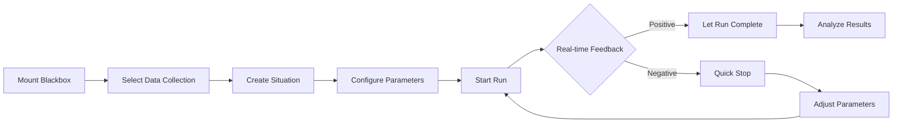
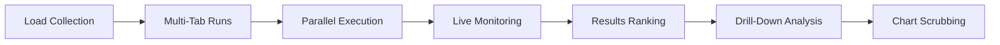

# FiniexTestingIDE - UI/UX Konzept & Workflows

## Vision: IDE-artige Trading-Strategy-Testumgebung

**Kernphilosophie:** Intuitive, performante Entwicklungsumgebung die es ermöglicht, Trading-Strategien (Blackboxes) gegen historische Marktdaten zu testen, ohne den Testlauf durch Visualisierung zu beeinträchtigen.

---

## Hauptkomponenten der IDE

### 1. Blackbox-Manager
**Funktion:** Mount/Unmount von Strategy-Blackboxes
```
┌─────────────────────┐
│ 📦 Blackbox Manager │
├─────────────────────┤
│ ✓ MACDStrategy v1.2 │
│ ✓ EnvelopeBot v2.1  │
│ + Mount New...      │
└─────────────────────┘
```

**Workflows:**
- Drag & Drop von .py/.mql5/.dll Blackbox-Files
- Automatic Parameter-Schema-Erkennung
- Live Parameter-Validation
- Version-Management pro Blackbox

### 2. Datenkollektion-Manager
**Funktion:** Auswahl und Kuration von Marktdaten-Situationen

```
┌─────────────────────────────────────┐
│ 📊 Datenkollektion Manager          │
├─────────────────────────────────────┤
│ Quelldata: EURUSD_2024_Q1.parquet  │
│ ├─ Situation 1: "NFP Friday Crash" │
│ │   📅 2024-01-05 14:30 - 16:00    │
│ │   📈 High volatility detected    │
│ ├─ Situation 2: "London Opening"   │
│ │   📅 2024-01-08 08:00 - 09:00    │
│ │   📊 Normal liquidity            │
│ └─ + Add New Situation...          │
└─────────────────────────────────────┘
```

**Features:**
- **Timeline-Scrubber:** Drag-Select für Start/End-Zeitpunkt
- **Situationen-Bibliothek:** Vordefinierte Marktszenarien (News, Sessions, Volatilität)
- **Quality-Score-Integration:** Nur Daten über konfigurierbarem Threshold
- **Batch-Creation:** 1-1000+ Situationen aus Pattern-Erkennung

### 3. Multi-Tab Test-Runner
**Funktion:** Parallel-Execution mehrerer isolierter Test-Runs

```
┌─ Tab 1: MACD-Fast ─┬─ Tab 2: MACD-Slow ─┬─ Tab 3: Envelope ─┐
│ Status: Running    │ Status: Completed  │ Status: Queued   │
│ Progress: ████░░░  │ Sharpe: 1.42      │ Est. Start: 2min │
│ 📈 +2.3% (trend↗) │ MaxDD: -8.5%      │                  │
└────────────────────┴────────────────────┴──────────────────┘
```

**Tab-Isolation-Prinzip:**
- **Eine Blackbox pro Tab:** Jeder Tab läuft eine spezifische Blackbox-Instanz
- **Eigene Parameter-Sets:** Tab-Namen spiegeln die Parameter-Variation wider
- **Unabhängige Ressourcen:** Separate CPU/RAM-Budgets pro Tab
- **Isolierte Test-Läufe:** Kein Cross-Tab-State, vollständige Parallelisierung

**Tab-Naming-Convention:**
```
"MACD-Fast" = MACDStrategy mit {fast: 8, slow: 21, signal: 9}
"MACD-Slow" = MACDStrategy mit {fast: 15, slow: 30, signal: 12}
"Envelope"  = EnvelopeStrategy mit {dev: 1.5, length: 20}
```

**Real-time Feedback:**
- Live Performance-Indikatoren (Profit, Sharpe-Trend)
- Resource-Usage (CPU/RAM) pro Tab
- ETA basierend auf aktueller Performance
- Quick-Stop bei negativer Tendenz-Erkennung
- Cross-Tab-Performance-Comparison (optional sidebar)

### 4. Parameter-Panel mit Dependency-Management
**Funktion:** Intelligente Parameter-Eingabe mit Blackbox-Constraints

```
┌─ Parameters ─────────────────────────┐
│ MACD Settings                        │
│ ├─ Fast Period    [12] ◄──┐         │
│ ├─ Slow Period    [26]     │         │
│ └─ Signal Period  [9]      │         │
│                            │         │
│ Risk Management           │         │
│ ├─ Risk per Trade [2.0%] ─┘         │
│ └─ Max Drawdown   [15%]             │
│                                     │
│ ⚠️ Warning: Fast > Slow not allowed │
│ 💡 Suggestion: Reduce risk to 1.5% │
└─────────────────────────────────────┘
```

**Smart Features:**
- **Dependency-Validation:** Blackbox definiert Parameter-Constraints
- **Real-time Suggestions:** Performance-basierte Parameter-Empfehlungen
- **Quick-Presets:** Gespeicherte Parameter-Sets für häufige Konfigurationen
- **A/B-Comparison-Mode:** Split-Screen für Parameter-Vergleiche

---

## Core-Workflows

### Workflow 1: Neue Strategy-Entwicklung


### Workflow 2: Batch-Testing & Collection-Analysis


---

## Detaillierte UI-Konzepte

### Timeline-Scrubber & Chart-Navigation

```
Timeline Scrubber:
├─────────●─────────────────────●─────────┤
│    Start: 08:30         Current: 14:25   │
│    [◄◄] [◄] [⏸] [►] [►►]               │
│    Speed: [1x] [5x] [10x] [Max]        │
└────────────────────────────────────────────┘

Chart View:
┌─────────────────────────────────────────────┐
│  📈 EURUSD Candlesticks + Indicators       │
│  ┌─ MACD ─┬─ RSI ─┬─ Signals ────────────┐ │
│  │ ▲ Buy  │  📊   │ ● Entry Points      │ │
│  │ ▼ Sell │  📈   │ ◆ Exit Points       │ │
│  └────────┴───────┴──────────────────────┘ │
│  💡 Debug Info: trend="up", confidence=0.8 │
└─────────────────────────────────────────────┘
```

**Features:**
- **Frame-by-Frame Navigation:** Jeder Tick/Bar einzeln durchgehbar
- **Debug-Overlay:** Blackbox-Metadaten als Overlay (an/aus schaltbar)
- **Multi-Layer-Charts:** Preise, Indikatoren, Signale in separaten Panels
- **Zoom & Pan:** Fokus auf kritische Zeitfenster

### Live-Statistics-Dashboard

```
┌─ Live Statistics ──────────────────────┐
│ Current Run: MACD_v1.2                 │
│ ├─ Elapsed Time:    [████████░░] 80%  │
│ ├─ Processed Bars:  8,542 / 10,000    │
│ ├─ Current P&L:     +$2,450 (📈+2.3%) │
│ ├─ Active Trades:   2 positions       │
│ ├─ Sharpe (live):   1.26 ± 0.15       │
│ └─ Max Drawdown:    -4.2%              │
│                                        │
│ Performance Trend: ████████▲▲         │
│ Prediction: 78% chance of positive end │
└────────────────────────────────────────┘
```

**Real-time Updates:**
- **Live P&L-Kurve:** Performance-Chart während der Ausführung
- **Risk-Monitoring:** Drawdown-Alerts, Position-Size-Warnings
- **Trend-Prediction:** ML-basierte Prognose des finalen Ergebnisses
- **Resource-Monitor:** CPU/RAM-Usage pro Test-Run

### Results-Collection-Explorer

```
┌─ Collection Results Explorer ──────────────────────────────────┐
│ Sort by: [Final Sharpe ▼] Filter: [Completed ▼] [All Pairs ▼] │
├────────────────────────────────────────────────────────────────┤
│ 🔴 Run #1247  | MACD Fast=8   | Sharpe: -0.42 | MaxDD: -18%  │
│ 🔴 Run #1089  | Envelope σ=3  | Sharpe: -0.21 | MaxDD: -25%  │
│ 🟡 Run #1156  | MACD Fast=15  | Sharpe:  0.15 | MaxDD: -12%  │
│ 🟢 Run #1203  | MACD Fast=12  | Sharpe:  1.67 | MaxDD: -6%   │
│ 🟢 Run #1255  | MACD Fast=10  | Sharpe:  1.89 | MaxDD: -4%   │
└────────────────────────────────────────────────────────────────┘
```

**Sorting & Filtering:**
- **Performance-Ranking:** Fatale Runs oben, beste Runs unten
- **Multi-Criteria-Sorting:** Sharpe, MaxDD, Win-Rate, Profit Factor
- **Advanced Filters:** Parameter-Ranges, Zeitfenster, Symbol-Groups
- **Export Options:** CSV, JSON, PDF-Report aller gefilterten Runs

---

## Performance-Optimierung

### Non-Blocking-Visualization
**Prinzip:** Alle UI-Updates laufen in separaten Threads/Workers
```python
# Pseudocode Architecture
BacktestEngine (Core Thread)
├── Tick Processing → Strategy Execution → Trade Generation
├── → Event Bus (Non-blocking)
    ├── → UI Update Worker (Charts, Statistics)
    ├── → Storage Worker (Artifacts, Logs)
    └── → WebSocket Worker (Real-time Updates)
```

### Efficient Chart-Rendering
- **Canvas-based Charts:** WebGL für 10.000+ Datenpunkte
- **Progressive Loading:** Nur sichtbare Timeframes rendern
- **Lazy Debug-Data:** Blackbox-Metadaten nur on-demand laden
- **Viewport-Culling:** Off-screen-Elemente nicht berechnen

### Memory-Management
- **Streaming-Data:** Große Collections nicht komplett in RAM laden
- **LRU-Cache:** Häufig verwendete Situationen cachen
- **Tab-Suspension:** Inaktive Tabs pausieren/reduzieren Updates
- **Garbage-Collection:** Abgeschlossene Runs aus RAM entfernen

---

## Advanced-Features

### Smart-Parameter-Suggestions
**ML-basierte Parameter-Optimierung:**
```python
# Beispiel-Integration
class ParameterSuggester:
    def analyze_performance_correlation(self, completed_runs):
        # Analysiere welche Parameter zu besseren Ergebnissen führten
        return parameter_suggestions
    
    def suggest_next_iteration(self, current_params, current_performance):
        # Basierend auf aktueller Performance, schlage Anpassungen vor
        return optimized_params
```

### Collection-Pattern-Recognition
**Automatische Situationen-Erkennung:**
- **Volatility-Spikes:** Automatische Erkennung von News-Events
- **Session-Transitions:** London/NY-Overlaps, Asian-Close-Patterns
- **Seasonal-Patterns:** Monatsende, Quarter-End, Holiday-Effects
- **Technical-Patterns:** Support/Resistance-Breaks, Trend-Changes

### Multi-Strategy-Comparison
**Side-by-Side-Analysis:**
```
┌─ Strategy Comparison ────────────────────────────────────────┐
│         │ MACD v1.2 │ Envelope │ RSI Mean │ Combined      │
├─────────┼───────────┼──────────┼──────────┼───────────────┤
│ Sharpe  │    1.42   │   0.89   │   1.15   │     1.67      │
│ MaxDD   │   -8.5%   │  -12.3%  │  -6.2%   │    -5.1%     │
│ Trades  │    247    │   156    │   203    │     312       │
│ Win%    │   68.4%   │  72.1%   │  64.0%   │    71.2%     │
└─────────┴───────────┴──────────┴──────────┴───────────────┘
```

---

## Implementation-Priorities

### Phase 1: Core-IDE (MVP)
- **Basic UI-Layout:** Tab-System, Parameter-Panel, Chart-View
- **Blackbox-Integration:** Mount/Unmount, Parameter-Schema
- **Single-Run-Testing:** Ein Test zur Zeit, basic Charts
- **Data-Collection-Manager:** Simple Zeitfenster-Auswahl

### Phase 2: Multi-Processing
- **Multi-Tab-Runs:** Parallel-Execution in separaten Prozessen
- **Live-Statistics:** Real-time Performance-Updates
- **Results-Explorer:** Collection-Ranking und Drill-Down
- **Timeline-Scrubber:** Chart-Navigation mit Debug-Overlay

### Phase 3: Advanced-Features
- **Smart-Parameter-Suggestions:** ML-basierte Optimierungen
- **Pattern-Recognition:** Automatische Situationen-Erkennung
- **Advanced-Visualization:** WebGL-Charts, Multi-Layer-Overlays
- **Comparison-Tools:** Side-by-Side Strategy-Analysis

---

## Technische Integration

### Frontend-Architektur
```
React/Vue3 SPA
├── Monaco Editor (Parameter-Editing)
├── Plotly.js / D3.js (Charts)
├── WebSocket Client (Real-time Updates)
├── Web Workers (Chart-Rendering)
└── Service Workers (Offline-Caching)
```

### Backend-API-Integration
```python
# WebSocket Events für Live-Updates
{
    "event": "run.progress",
    "run_id": "abc123",
    "data": {
        "progress": 0.75,
        "current_pnl": 2450.0,
        "live_sharpe": 1.26,
        "trades_count": 23
    }
}

# REST-API für Run-Management
POST /api/runs/start
GET  /api/runs/{run_id}/chart-data
GET  /api/collections/{id}/situations
PUT  /api/blackboxes/{id}/parameters
```

### Data-Pipeline-Integration
- **Quality-Aware-Loading:** Nur Daten über konfigurierbarem Quality-Score
- **Streaming-Interface:** Große Collections chunk-wise laden
- **Caching-Strategy:** Häufig verwendete Situationen im Browser-Cache
- **Offline-Mode:** Grundfunktionalität ohne Server-Connection

---

## Fazit

Die FiniexTestingIDE bietet eine **intuitive, performante Entwicklungsumgebung** für Trading-Strategy-Testing. Durch **non-blocking Visualization**, **intelligent Parameter-Management** und **real-time Performance-Feedback** ermöglicht sie effiziente Strategie-Entwicklung ohne Kompromisse bei der Test-Performance.

**Kernvorteile:**
- **IDE-artige UX:** Vertraute Entwicklungsumgebung für Trader
- **Parallel-Testing:** Multiple Runs ohne Performance-Verlust  
- **Live-Feedback:** Sofortige Performance-Indikatoren
- **Smart-Tools:** ML-basierte Parameter-Optimierung
- **Visual-Debugging:** Frame-by-Frame Strategy-Analysis

Die Architektur ist darauf ausgelegt, von **einzelnen Tests** bis zu **1000+ parallelen Szenarien** zu skalieren, während die Benutzerfreundlichkeit einer modernen IDE erhalten bleibt.
