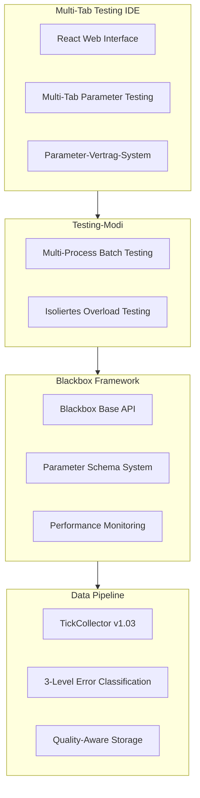
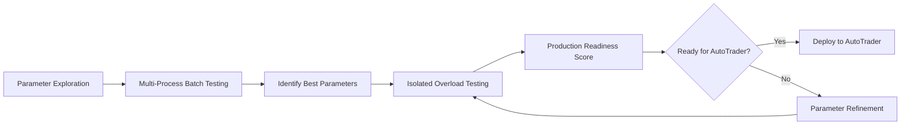

# FiniexTestingIDE - Korrigierte Kern-Architektur

## Status: Prototyp-Entwicklung

**Klarstellung:** Dies ist die Konzeption eines Prototyps, der zum finalen System entwickelt wird. Alle beschriebenen Features sind geplant/in Entwicklung.

---

## Kern-Architektur-Übersicht



---

## 1. Blackbox-Parameter-Vertrag-System

### Parameter-Binding beim Mount

```python
class BlackboxParameterContract:
    """
    Beim Mounten der Blackbox wird ein Vertrag zwischen IDE und Blackbox geschlossen
    """
    
    def mount_blackbox(self, blackbox_class):
        # 1. Parameter-Schema von Blackbox abrufen
        schema = blackbox_class.get_parameter_schema()
        
        # 2. Parameter-Dependencies analysieren
        dependencies = self.analyze_parameter_dependencies(schema)
        
        # 3. UI-Bindung erstellen
        ui_controls = self.create_parameter_ui(schema, dependencies)
        
        # 4. Validation-Rules einrichten
        validators = self.setup_parameter_validators(schema)
        
        return ParameterContract(schema, dependencies, ui_controls, validators)

class BlackboxBase(ABC):
    @abstractmethod
    def get_parameter_schema(self) -> ParameterSchema:
        """
        Blackbox definiert ihre Parameter und deren Beziehungen
        """
        return ParameterSchema(
            parameters={
                'volatility_threshold': Parameter(
                    type=float, default=0.015, min=0.005, max=0.05,
                    description="Minimum volatility to trigger trades",
                    sensitivity='HIGH',
                    affects=['trade_frequency', 'drawdown_risk']
                ),
                'risk_per_trade': Parameter(
                    type=float, default=0.02, min=0.005, max=0.1,
                    dependency=lambda p: p['volatility_threshold'] * 5,  # Max risk scales with volatility
                    auto_adjust=True
                )
            },
            synergies={
                ('volatility_threshold', 'risk_per_trade'): SynergyRule(
                    relationship='inverse_correlation',
                    strength=0.8,
                    auto_suggestion=True
                )
            }
        )
```

### Parameter-UI-Integration

```
┌─ Tab: MACD-Conservative ────────────────────────────────────────┐
│ ┌─ Parameter Panel ─────────┐ ┌─ Synergy Visualization ────────┐ │
│ │ Volatility Settings       │ │ ⚡ Dependencies Detected:       │ │
│ │ ├─ Threshold [0.015] ████▒▒│ │   volatility_threshold ←→      │ │
│ │ │              ↑ HIGH      │ │   risk_per_trade               │ │
│ │ Risk Management           │ │                                │ │
│ │ ├─ Per Trade [0.020] ████▒▒│ │ 💡 Auto-Suggestion:            │ │
│ │ │           ↑ Linked       │ │   Based on current volatility  │ │
│ │                           │ │   consider: risk → 0.018       │ │
│ └───────────────────────────┘ └─────────────────────────────────┘ │
└─────────────────────────────────────────────────────────────────┘
```

---

## 2. Testing-Modi-Architektur

### Problem: CPU-Ressourcen-Konflikt gelöst

```python
class TestingModeManager:
    """
    Löst das CPU-Verteilungs-Problem durch verschiedene Testing-Modi
    """
    
    def multi_process_batch_testing(self, parameter_variations):
        """
        Hunderte parallele Tests für Parameter-Exploration
        - Jeder Prozess: Eine Blackbox-Instanz
        - CPU-Power: Verteilt auf alle Prozesse
        - Zweck: Parameter-Raum-Exploration
        - Overload-Simulation: NICHT möglich (unrealistische Bedingungen)
        """
        processes = []
        for params in parameter_variations:
            p = Process(target=self.run_isolated_test, args=(params,))
            processes.append(p)
            p.start()
        
        return self.collect_batch_results(processes)
    
    def isolated_overload_testing(self, optimized_parameters):
        """
        Einzelner Test für Production-Readiness-Validation
        - Ein Prozess: Eine Blackbox-Instanz
        - CPU-Power: Vollständig verfügbar (wie im AutoTrader)
        - Zweck: Realistische Performance-Validation
        - Overload-Simulation: Vollständig aktiviert
        """
        simulator = OverloadSimulator(
            tick_frequency_range=(50, 1000),  # Hz
            cpu_budget=100,  # Vollständige CPU verfügbar
            realistic_constraints=True
        )
        
        return simulator.run_production_readiness_test(optimized_parameters)
```

### Testing-Workflow



---

## 3. Performance-Monitoring-System

### Blackbox Performance Contract

```python
class BlackboxPerformanceMonitor:
    """
    Monitoring-System das in beiden Modi funktioniert
    """
    
    def monitor_batch_testing(self, blackbox_instance):
        """
        Leichtgewichtiges Monitoring für Batch-Tests
        - Fokus: Relative Performance zwischen Parameter-Sets
        - Metrics: Sharpe, MaxDD, Trade-Count
        - CPU-Impact: Minimal
        """
        return BatchPerformanceMetrics(
            processing_time_avg=self.measure_avg_processing(),
            memory_usage=self.measure_memory(),
            signal_generation_rate=self.measure_signal_rate()
        )
    
    def monitor_overload_testing(self, blackbox_instance):
        """
        Detailliertes Monitoring für Overload-Tests
        - Fokus: Absolute Performance unter Stress
        - Metrics: Latenz, Timeout-Rate, CPU-Usage
        - CPU-Impact: Akzeptabel (da isoliert)
        """
        return OverloadPerformanceMetrics(
            tick_processing_latency_p99=self.measure_latency_p99(),
            timeout_events=self.count_timeout_events(),
            adaptive_mode_switches=self.count_mode_switches(),
            production_readiness_score=self.calculate_readiness_score()
        )
```

### Performance-UI-Integration

```
┌─ Tab: MACD-Optimized (Overload Test) ──────────────────────────┐
│ ┌─ Batch Results ──────────┐ ┌─ Overload Performance ─────────┐ │
│ │ Sharpe: 1.67            │ │ Production Readiness: 87/100   │ │
│ │ MaxDD: -6.2%            │ │ ├─ Avg Latency: 2.1ms         │ │
│ │ Trades: 234             │ │ ├─ P99 Latency: 4.8ms         │ │
│ │                         │ │ ├─ Timeout Rate: 3.2%         │ │
│ │ ✅ Best in Parameter Set │ │ ├─ Mode Switches: 12          │ │
│ └─────────────────────────┘ │ │                             │ │
│                             │ │ ⚠️  Needs Optimization:      │ │
│ [🧪 Run Overload Test]      │ │    • RSI calculation slow    │ │
│                             │ │    • Consider caching        │ │
│                             └─────────────────────────────────┘ │
└─────────────────────────────────────────────────────────────────┘
```

---

## 4. Overload-Simulation-System

### Realistische Test-Bedingungen

```python
class OverloadSimulator:
    """
    Simuliert realistische AutoTrader-Bedingungen in isoliertem Prozess
    """
    
    def __init__(self, blackbox):
        self.blackbox = blackbox
        self.tick_frequency = 100  # Hz (dynamic)
        self.cpu_budget = 100      # Vollständige CPU verfügbar
        
    async def simulate_realistic_conditions(self, market_data):
        """
        Simuliert verschiedene Markt-Bedingungen:
        - Normal: 50-100 ticks/sec
        - Volatil: 200-500 ticks/sec  
        - News Events: 500-1000 ticks/sec
        """
        
        scenarios = [
            NormalMarketScenario(tick_rate=75),
            VolatileMarketScenario(tick_rate=350),
            NewsEventScenario(tick_rate=800, duration_seconds=30)
        ]
        
        results = {}
        for scenario in scenarios:
            results[scenario.name] = await self.run_scenario(scenario, market_data)
            
        return OverloadTestReport(results)
    
    async def run_scenario(self, scenario, data):
        """
        Einzelnes Szenario mit realistischen Timing-Constraints
        """
        performance_metrics = PerformanceTracker()
        
        async for tick in self.generate_ticks(data, scenario.tick_rate):
            start_time = time.perf_counter()
            
            try:
                signal = await asyncio.wait_for(
                    self.blackbox.on_tick(tick),
                    timeout=scenario.max_processing_time_ms / 1000
                )
                
                processing_time = time.perf_counter() - start_time
                performance_metrics.record_success(processing_time)
                
            except asyncio.TimeoutError:
                performance_metrics.record_timeout()
                signal = self.blackbox.get_last_signal()  # Emergency fallback
                
        return performance_metrics.generate_report()
```

---

## 5. Data Pipeline - Aktuelle Implementierung

### Quality-Aware Data Processing

```python
class DataQualityPipeline:
    """
    Implementierter Teil: MQL5 → JSON → Python → Parquet
    """
    
    def __init__(self):
        self.quality_classifier = ErrorClassifier()
        self.parquet_converter = QualityAwareParquetConverter()
        
    def process_tick_collection(self, json_files):
        """
        3-Level Error Classification während Processing
        """
        for json_file in json_files:
            # 1. Load and validate
            raw_data = self.load_json_ticks(json_file)
            
            # 2. Classify errors
            quality_report = self.quality_classifier.classify_errors(raw_data)
            
            # 3. Generate quality scores
            quality_scores = self.calculate_quality_scores(quality_report)
            
            # 4. Convert to Parquet with metadata
            parquet_file = self.parquet_converter.convert_with_quality_metadata(
                raw_data, quality_scores, quality_report
            )
            
            yield QualityDataset(parquet_file, quality_scores)
```

---

## 6. AutoTrader-Integration-Vorbereitung

### Nahtloser Handover

```python
class BlackboxDeploymentBridge:
    """
    Vorbereitung für nahtlosen Testing → AutoTrader Transfer
    """
    
    def prepare_for_deployment(self, tested_blackbox, performance_report):
        """
        Optimierte Blackbox für AutoTrader-Deployment vorbereiten
        """
        if performance_report.production_readiness_score < 80:
            raise ProductionNotReadyError(
                f"Score {performance_report.production_readiness_score} < 80. "
                f"Optimize: {performance_report.optimization_suggestions}"
            )
        
        # Optimierte Parameter einbrennen
        production_blackbox = self.create_production_instance(
            tested_blackbox, 
            performance_report.optimal_parameters
        )
        
        # AutoTrader-Konfiguration generieren
        autotrader_config = self.generate_autotrader_config(
            production_blackbox, 
            performance_report
        )
        
        return DeploymentPackage(production_blackbox, autotrader_config)
```

---

## MVP-Prioritäten

### Phase 1: Kern-Framework
1. **Blackbox Base API** - Parameter-Contract-System
2. **Basic UI** - Ein Tab, Parameter-Panel mit Synergie-Anzeige
3. **Data Pipeline** - JSON → Parquet Quality-Processing
4. **Single-Process Testing** - Ein Test zur Zeit

### Phase 2: Multi-Processing
1. **Multi-Tab System** - Parallele Parameter-Tests
2. **Batch Testing Engine** - Hunderte parallele Prozesse
3. **Results Collection** - Performance-Ranking und -Vergleich

### Phase 3: Overload-System
1. **Isolated Overload Testing** - Realistische Performance-Validation
2. **Production-Readiness-Scoring** - Deployment-Entscheidungshilfe
3. **AutoTrader-Integration-Vorbereitung** - Seamless Handover

---

## Fazit: Gelöstes Architektur-Problem

**CPU-Ressourcen-Konflikt gelöst durch:**
- **Batch-Testing**: Parameter-Exploration mit verteilter CPU
- **Isolated-Testing**: Production-Validation mit voller CPU
- **Unterschiedliche Monitoring**: Leichtgewichtig vs. detailliert
- **Klare Zweck-Trennung**: Exploration vs. Validation

**Parameter-System:**
- Blackbox definiert Parameter-Schema und -Dependencies
- IDE bindet Parameter dynamisch in UI
- Real-time Synergie-Visualisierung und Auto-Suggestions

**Übergang zu AutoTrader:**
- Identische Blackbox-API in beiden Systemen
- Performance-validierte Parameter-Sets
- Production-Readiness-Scoring für sichere Deployments