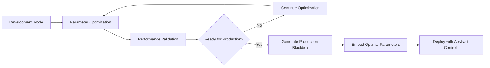
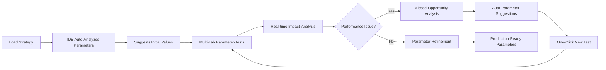
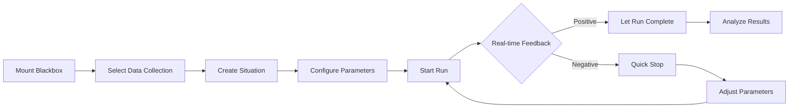
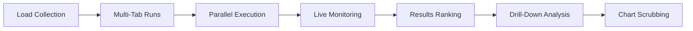

# FiniexTestingIDE - UI/UX Konzept & Workflows

## Vision: Parameter-zentrierte Entwicklung statt Code-zentrierte Entwicklung

**Das fundamentale Problem:** In der Trading-Strategy-Entwicklung wird 80% der Zeit für Parameter-Tuning aufgewendet, aber nur 20% für Algorithmus-Logik. Trotzdem sind die meisten Tools code-zentriert aufgebaut.

**FiniexTestingIDE-Philosophie:** 
- **Parameter sind First-Class-Citizens** - nicht nachträgliche Konfiguration
- **Blackbox-zu-IDE-Vertrag optimieren** für maximale Parameter-Intelligenz
- **Micro-Parameter-Changes** mit Macro-Impact schnell testbar machen
- **Markt-Situationen-Analyse** wo Parameter versagen transparent machen

### Problem-Analyse aus der Praxis:

**Typische Entwicklungszeit-Verteilung:**
```
Algorithmus-Logik:     20% der Zeit
Parameter-Fine-Tuning: 60% der Zeit  
Situation-Analysis:    15% der Zeit (wo versagt die Strategie?)
Code-Debugging:        5% der Zeit
```

**Häufige Parameter-Impact-Szenarien:**
- Volatilitäts-Threshold um 0.1% geändert → 40% weniger Trades
- Risk-per-Trade von 2% auf 1.5% → MaxDrawdown halbiert
- Moving-Average-Period +2 → Komplett andere Markt-Situationen erfasst

**Das "Missed-Opportunity-Problem":**
Testlauf zeigt: Strategy nimmt 60% der profitablen Markt-Bewegungen nicht mit.
**Root-Cause:** Ein einziger Parameter (z.B. Trend-Confirmation-Threshold) zu konservativ.
**Debugging-Aufwand:** Stunden von manueller Chart-Analyse um das zu finden.

---

## Der Blackbox-Parameter-Zielkonflikt & Lösungsansatz

### Das fundamentale Spannungsfeld

**Blackbox-Prinzip:** Algorithmus-Logik bleibt geheim für IP-Schutz
**Parameter-Realität:** Parameter bestimmen 80% des Erfolgs und müssen optimierbar sein

**Problem:** Zu detaillierte Parameter-Exposition ermöglicht Reverse-Engineering der Strategie. Zu abstrakte Parameter machen effektives Tuning unmöglich.

### Dreistufige Parameter-Architektur

#### 1. Development-Mode: Vollständige Parameter-Exposition
```python
# Alle internen Parameter für Optimierung sichtbar
development_params = {
    'volatility_threshold': 0.015,
    'fast_ema_period': 12,
    'slow_ema_period': 26,
    'risk_per_trade': 0.02,
    'trend_confirmation': 0.8
}
```

#### 2. Hybrid-Mode: Abstrahierte Parameter-Layer
```python
# Öffentliche Parameter (IDE-sichtbar)
public_params = {
    'market_sensitivity': 0.7,      # Maps zu mehreren internen Parametern
    'risk_appetite': 0.3,           # Abstrakte Risk-Management-Kontrolle
    'trend_following_strength': 0.8 # Trend-Detection-Aggressivität
}

# Private Mapping (in Blackbox verborgen)
# market_sensitivity → volatility_threshold, confirmation_levels
# risk_appetite → position_sizing, stop_loss_distance
```

#### 3. Production-Mode: Eingebrannte Parameter
```python
# Optimale Parameter sind in Blackbox hart-codiert
class MACDStrategy_PROD(BlackboxBase):
    def __init__(self):
        self.volatility_threshold = 0.012  # Optimiert und eingebrannt
        self.fast_period = 10              # Keine externe Konfiguration
        # Nur noch minimale Live-Adjustments möglich
```

### Parameter-Synergie-Management

**Klassisches Beispiel: Spread-Volatilität-Kopplung**
```python
# Niedrigere Spreads → Mehr Trades möglich bei gleicher Profitabilität
effective_volatility_threshold = base_volatility * (current_spread / reference_spread)

# IDE visualisiert diese Synergien automatisch
parameter_synergies = {
    ('spread_sensitivity', 'volatility_threshold'): {
        'relationship': 'inverse_correlation',
        'formula': 'vol_thresh = base_vol * (spread_ratio)',
        'strength': 0.85,
        'description': 'Lower spreads allow more aggressive volatility entry'
    }
}
```

### IDE-Integration der Parameter-Modi

#### Development-Phase UI
```
┌─ Development Mode ─────────────────────────────────────────┐
│ 🔓 Full Parameter Access                                   │
│ ├─ volatility_threshold    [0.015] ████████░░             │
│ ├─ fast_ema_period        [12]    ████████░░             │
│ ├─ trend_confirmation     [0.8]   ████████░░             │
│ └─ risk_per_trade         [0.02]  ████████░░             │
│                                                           │
│ 💡 Optimization Suggestions Available                     │
│ 📊 Full Missed-Opportunity Analysis                       │
└───────────────────────────────────────────────────────────┘
```

#### Production-Phase UI
```
┌─ Production Mode ──────────────────────────────────────────┐
│ 🔒 Abstracted Parameter Control                           │
│ ├─ Market Sensitivity     [0.7]   ████████░░             │
│ ├─ Risk Appetite          [0.3]   ████████░░             │
│ └─ Trend Aggressiveness   [0.8]   ████████░░             │
│                                                           │
│ ⚠️  Limited tuning - core parameters are optimized       │
│ 📈 Performance tracking only                             │
└───────────────────────────────────────────────────────────┘
```

### Parameter-Einbrennung-Workflow



### Schutz vor Reverse-Engineering

**Development-Schutz:**
- Parameter-Namen abstrahiert (keine "ema_12_26" sondern "trend_sensitivity")
- Komplexe Parameter-Mappings verborgen
- Synergie-Formeln in Blackbox gekapselt

**Production-Schutz:**
- Minimale Parameter-Exposition
- Alle kritischen Werte eingebrannt
- Nur noch "Tuning-Knobs" für Live-Adjustments

**Audit-Trail:**
- Vollständige Parameter-Optimierung-Historie
- Einbrennung-Timestamps und -Begründungen
- Performance-Vergleich vor/nach Einbrennung

### Praktische Implementierung

**IDE unterstützt nahtlosen Modus-Wechsel:**
- Development → Hybrid → Production
- Automatische Parameter-Abstraction-Generierung  
- One-Click Production-Blackbox-Generierung
- Rollback-Möglichkeit für weitere Optimierungen

Dieser Ansatz löst den Zielkonflikt zwischen IP-Schutz und Parameter-Optimierung durch gestufte Abstraction und Einbrennung optimaler Werte.

### Enhanced Blackbox-Contract für Parameter-Intelligence

```python
class EnhancedBlackboxBase(ABC):
    @abstractmethod
    def get_parameter_schema(self) -> ParameterSchema:
        """Erweiterte Parameter-Definition mit Synergien und Constraints"""
        return ParameterSchema(
            parameters={
                'volatility_threshold': Parameter(
                    type=float, default=0.015, min=0.005, max=0.05,
                    description="Minimum volatility to trigger trades",
                    impact_description="Higher = fewer trades, lower drawdown",
                    synergies=['risk_per_trade', 'trend_confirmation'],
                    sensitivity='HIGH'  # Parameter-Change-Impact-Level
                ),
                'risk_per_trade': Parameter(
                    type=float, default=0.02, min=0.005, max=0.1,
                    constraint=lambda p: p['volatility_threshold'] * 10,  # Max risk based on volatility
                    auto_suggestion=True  # IDE kann Auto-Adjustments vorschlagen
                )
            },
            parameter_synergies={
                ('volatility_threshold', 'risk_per_trade'): SynergyRule(
                    relationship='inverse_correlation',
                    strength=0.8,
                    description="Higher volatility → lower risk recommended"
                )
            }
        )
    
    @abstractmethod
    def get_market_situation_analysis(self) -> MarketSituationSchema:
        """Definiert welche Markt-Situationen die Strategy analysieren kann"""
        return MarketSituationSchema(
            detectable_patterns=[
                'trending_market', 'ranging_market', 'high_volatility', 
                'news_event', 'session_transition', 'low_liquidity'
            ],
            decision_factors=[
                'trend_strength', 'volatility_level', 'liquidity_assessment'
            ]
        )
    
    def on_missed_opportunity(self, market_data, reason) -> OpportunityAnalysis:
        """Called by IDE when profitable move was missed - for parameter tuning hints"""
        return OpportunityAnalysis(
            missed_reason=reason,
            parameter_suggestions={'volatility_threshold': market_data.volatility * 0.8},
            confidence=0.7
        )
```

### IDE-Features für Parameter-zentrierte Entwicklung

#### 1. Smart Parameter-Panel mit Synergie-Awareness

```
┌─ Parameter Panel ──────────────────────────────────────────┐
│ Volatility Settings                                        │
│ ├─ Threshold        [0.015] ◄─────┐ Sensitivity: HIGH    │
│ │                   ████████░░    │ Impact: Trade Count   │
│ │                                 │                       │
│ Risk Management                   │                       │
│ ├─ Risk per Trade   [0.020] ◄─────┤ Auto-Linked         │
│ │                   ████████░░    │ Suggestion: 0.018    │
│                                   │                       │
│ ⚡ Synergy Detected:               │                       │
│    Higher volatility threshold    │                       │
│    → Lower risk recommended        │                       │
│                                   │                       │
│ 💡 IDE Suggestion:                │                       │
│    Based on last 3 runs, try:     │                       │
│    volatility_threshold = 0.012   │                       │
└────────────────────────────────────────────────────────────┘
```

#### 2. Missed-Opportunity-Analyzer

```
┌─ Market Situation Analysis ────────────────────────────────┐
│ Current Run: MACD-Conservative                             │
│                                                            │
│ 🔴 Missed Opportunities Detected: 23                      │
│                                                            │
│ Top Miss-Reasons:                                          │
│ ├─ Trend confirmation too strict     (12 opportunities)   │
│ ├─ Volatility threshold too high     (8 opportunities)    │
│ └─ Risk management too conservative  (3 opportunities)    │
│                                                            │
│ 📊 Analysis for 14:30-15:00 (NFP Release):               │
│    • Market volatility: 0.028 (above threshold 0.015)    │
│    • Missed +2.3% move due to trend_confirmation=0.8     │
│    • 💡 Suggestion: Lower to 0.6 for news events        │
│                                                            │
│ [Apply Suggestions] [Ignore] [New Test Run]               │
└────────────────────────────────────────────────────────────┘
```

#### 3. Parameter-Impact-Heatmap

```
┌─ Parameter Impact Matrix ──────────────────────────────────┐
│                    │ Sharpe │ MaxDD │ Trades │ Win Rate   │
│ ──────────────────┼────────┼───────┼────────┼──────────   │
│ volatility_thresh  │ 🔥HIGH │  MED  │ 🔥HIGH │   LOW      │
│ risk_per_trade     │  MED   │🔥HIGH │  LOW   │   MED      │
│ trend_confirmation │ 🔥HIGH │  MED  │ 🔥HIGH │  🔥HIGH    │
│ stop_loss_atr      │  LOW   │🔥HIGH │  LOW   │   MED      │
└────────────────────────────────────────────────────────────┘
```

#### 4. Real-time Parameter-Performance-Correlation

```
┌─ Live Parameter Analysis ──────────────────────────────────┐
│ Current: volatility_threshold = 0.015                     │
│                                                            │
│ Performance Trend:  ████████▼▼                           │
│                                                            │
│ 🔥 Alert: Last 50 bars show declining performance         │
│    Current market volatility: 0.031 (2x threshold)       │
│    Suggested adjustment: Increase threshold to 0.025      │
│                                                            │
│ Auto-Adjust: [Yes] [No] [Test in New Tab]                │
└────────────────────────────────────────────────────────────┘
```

---

## Parameter-Development-Workflow

### Optimized Development-Cycle



### Intelligent Parameter-Suggestions

**Based on Real Market-Feedback:**
- IDE überwacht welche profitable Moves verpasst wurden
- Analysiert Parameter-Correlation zu Missed-Opportunities  
- Schlägt spezifische Parameter-Adjustments vor
- Zeigt Expected-Impact-Prognose für Änderungen

**Cross-Tab-Learning:**
- Wenn Tab A bessere Performance zeigt als Tab B
- IDE analysiert Parameter-Differences automatisch
- Schlägt Parameter-Kombination von Tab A für andere Tabs vor
- Ermöglicht One-Click-Parameter-Transfer zwischen Tabs

### 1. Blackbox-Manager
**Funktion:** Mount/Unmount von Strategy-Blackboxes
```
┌─────────────────────┐
│ 📦 Blackbox Manager │
├─────────────────────┤
│ ✓ MACDStrategy v1.2 │
│ ✓ EnvelopeBot v2.1  │
│ + Mount New...      │
└─────────────────────┘
```

**Workflows:**
- Drag & Drop von .py/.mql5/.dll Blackbox-Files
- Automatic Parameter-Schema-Erkennung
- Live Parameter-Validation
- Version-Management pro Blackbox

### 2. Datenkollektion-Manager
**Funktion:** Auswahl und Kuration von Marktdaten-Situationen

```
┌─────────────────────────────────────┐
│ 📊 Datenkollektion Manager          │
├─────────────────────────────────────┤
│ Quelldata: EURUSD_2024_Q1.parquet  │
│ ├─ Situation 1: "NFP Friday Crash" │
│ │   📅 2024-01-05 14:30 - 16:00    │
│ │   📈 High volatility detected    │
│ ├─ Situation 2: "London Opening"   │
│ │   📅 2024-01-08 08:00 - 09:00    │
│ │   📊 Normal liquidity            │
│ └─ + Add New Situation...          │
└─────────────────────────────────────┘
```

**Features:**
- **Timeline-Scrubber:** Drag-Select für Start/End-Zeitpunkt
- **Situationen-Bibliothek:** Vordefinierte Marktszenarien (News, Sessions, Volatilität)
- **Quality-Score-Integration:** Nur Daten über konfigurierbarem Threshold
- **Batch-Creation:** 1-1000+ Situationen aus Pattern-Erkennung

### 3. Multi-Tab Test-Runner
**Funktion:** Parallel-Execution mehrerer isolierter Test-Runs

```
┌─ Tab 1: MACD-Fast ─┬─ Tab 2: MACD-Slow ─┬─ Tab 3: Envelope ─┐
│ Status: Running    │ Status: Completed  │ Status: Queued   │
│ Progress: ████░░░  │ Sharpe: 1.42      │ Est. Start: 2min │
│ 📈 +2.3% (trend↗) │ MaxDD: -8.5%      │                  │
│ ⚡ Perf: 2.1ms     │ 🟢 Ready: 96/100  │ 🟡 Pending      │
└────────────────────┴────────────────────┴──────────────────┘
```

**Tab-Isolation-Prinzip:**
- **Eine Blackbox pro Tab:** Jeder Tab läuft eine spezifische Blackbox-Instanz
- **Eigene Parameter-Sets:** Tab-Namen spiegeln die Parameter-Variation wider
- **Unabhängige Ressourcen:** Separate CPU/RAM-Budgets pro Tab
- **Isolierte Test-Läufe:** Kein Cross-Tab-State, vollständige Parallelisierung
- **Performance-Tracking:** Individuelle Overload-Monitoring pro Tab

**Real-time Feedback:**
- Live Performance-Indikatoren (Profit, Sharpe-Trend)
- **Performance-Metrics** (Avg Processing-Time, Timeout-Rate)
- **Production-Readiness-Score** (🟢/🟡/🔴 Ampel-System)
- Resource-Usage (CPU/RAM) pro Tab
- ETA basierend auf aktueller Performance
- Quick-Stop bei negativer Tendenz-Erkennung
- Cross-Tab-Performance-Comparison (optional sidebar)

**Tab-Naming-Convention:**
```
"MACD-Fast" = MACDStrategy mit {fast: 8, slow: 21, signal: 9}
"MACD-Slow" = MACDStrategy mit {fast: 15, slow: 30, signal: 12}
"Envelope"  = EnvelopeStrategy mit {dev: 1.5, length: 20}
```

**Real-time Feedback:**
- Live Performance-Indikatoren (Profit, Sharpe-Trend)
- Resource-Usage (CPU/RAM) pro Tab
- ETA basierend auf aktueller Performance
- Quick-Stop bei negativer Tendenz-Erkennung
- Cross-Tab-Performance-Comparison (optional sidebar)

### 4. Parameter-Panel mit Dependency-Management
**Funktion:** Intelligente Parameter-Eingabe mit Blackbox-Constraints

```
┌─ Parameters ─────────────────────────┐
│ MACD Settings                        │
│ ├─ Fast Period    [12] ◄──┐         │
│ ├─ Slow Period    [26]     │         │
│ └─ Signal Period  [9]      │         │
│                            │         │
│ Risk Management           │         │
│ ├─ Risk per Trade [2.0%] ─┘         │
│ └─ Max Drawdown   [15%]             │
│                                     │
│ ⚠️ Warning: Fast > Slow not allowed │
│ 💡 Suggestion: Reduce risk to 1.5% │
└─────────────────────────────────────┘
```

**Smart Features:**
- **Dependency-Validation:** Blackbox definiert Parameter-Constraints
- **Real-time Suggestions:** Performance-basierte Parameter-Empfehlungen
- **Quick-Presets:** Gespeicherte Parameter-Sets für häufige Konfigurationen
- **A/B-Comparison-Mode:** Split-Screen für Parameter-Vergleiche

---

## Core-Workflows

### Workflow 1: Neue Strategy-Entwicklung


### Workflow 2: Batch-Testing & Collection-Analysis


---

## Detaillierte UI-Konzepte

### Timeline-Scrubber & Chart-Navigation

```
Timeline Scrubber:
├─────────●─────────────────────●─────────┤
│    Start: 08:30         Current: 14:25   │
│    [◄◄] [◄] [⏸] [►] [►►]               │
│    Speed: [1x] [5x] [10x] [Max]        │
└────────────────────────────────────────────┘

Chart View:
┌─────────────────────────────────────────────┐
│  📈 EURUSD Candlesticks + Indicators       │
│  ┌─ MACD ─┬─ RSI ─┬─ Signals ────────────┐ │
│  │ ▲ Buy  │  📊   │ ● Entry Points      │ │
│  │ ▼ Sell │  📈   │ ◆ Exit Points       │ │
│  └────────┴───────┴──────────────────────┘ │
│  💡 Debug Info: trend="up", confidence=0.8 │
└─────────────────────────────────────────────┘
```

**Features:**
- **Frame-by-Frame Navigation:** Jeder Tick/Bar einzeln durchgehbar
- **Debug-Overlay:** Blackbox-Metadaten als Overlay (an/aus schaltbar)
- **Multi-Layer-Charts:** Preise, Indikatoren, Signale in separaten Panels
- **Zoom & Pan:** Fokus auf kritische Zeitfenster

### Live-Statistics-Dashboard

```
┌─ Live Statistics ──────────────────────┐
│ Current Run: MACD_v1.2                 │
│ ├─ Elapsed Time:    [████████░░] 80%  │
│ ├─ Processed Bars:  8,542 / 10,000    │
│ ├─ Current P&L:     +$2,450 (📈+2.3%) │
│ ├─ Active Trades:   2 positions       │
│ ├─ Sharpe (live):   1.26 ± 0.15       │
│ └─ Max Drawdown:    -4.2%              │
│                                        │
│ Performance Trend: ████████▲▲         │
│ Prediction: 78% chance of positive end │
└────────────────────────────────────────┘
```

**Real-time Updates:**
- **Live P&L-Kurve:** Performance-Chart während der Ausführung
- **Risk-Monitoring:** Drawdown-Alerts, Position-Size-Warnings
- **Trend-Prediction:** ML-basierte Prognose des finalen Ergebnisses
- **Resource-Monitor:** CPU/RAM-Usage pro Test-Run

### Results-Collection-Explorer

```
┌─ Collection Results Explorer ──────────────────────────────────┐
│ Sort by: [Final Sharpe ▼] Filter: [Completed ▼] [All Pairs ▼] │
├────────────────────────────────────────────────────────────────┤
│ 🔴 Run #1247  | MACD Fast=8   | Sharpe: -0.42 | MaxDD: -18%  │
│ 🔴 Run #1089  | Envelope σ=3  | Sharpe: -0.21 | MaxDD: -25%  │
│ 🟡 Run #1156  | MACD Fast=15  | Sharpe:  0.15 | MaxDD: -12%  │
│ 🟢 Run #1203  | MACD Fast=12  | Sharpe:  1.67 | MaxDD: -6%   │
│ 🟢 Run #1255  | MACD Fast=10  | Sharpe:  1.89 | MaxDD: -4%   │
└────────────────────────────────────────────────────────────────┘
```

**Sorting & Filtering:**
- **Performance-Ranking:** Fatale Runs oben, beste Runs unten
- **Multi-Criteria-Sorting:** Sharpe, MaxDD, Win-Rate, Profit Factor
- **Advanced Filters:** Parameter-Ranges, Zeitfenster, Symbol-Groups
- **Export Options:** CSV, JSON, PDF-Report aller gefilterten Runs

---

## Performance-Optimierung

### Non-Blocking-Visualization
**Prinzip:** Alle UI-Updates laufen in separaten Threads/Workers
```python
# Pseudocode Architecture
BacktestEngine (Core Thread)
├── Tick Processing → Strategy Execution → Trade Generation
├── → Event Bus (Non-blocking)
    ├── → UI Update Worker (Charts, Statistics)
    ├── → Storage Worker (Artifacts, Logs)
    └── → WebSocket Worker (Real-time Updates)
```

### Efficient Chart-Rendering
- **Canvas-based Charts:** WebGL für 10.000+ Datenpunkte
- **Progressive Loading:** Nur sichtbare Timeframes rendern
- **Lazy Debug-Data:** Blackbox-Metadaten nur on-demand laden
- **Viewport-Culling:** Off-screen-Elemente nicht berechnen

### Memory-Management
- **Streaming-Data:** Große Collections nicht komplett in RAM laden
- **LRU-Cache:** Häufig verwendete Situationen cachen
- **Tab-Suspension:** Inaktive Tabs pausieren/reduzieren Updates
- **Garbage-Collection:** Abgeschlossene Runs aus RAM entfernen

---

## Advanced-Features

### Smart-Parameter-Suggestions
**ML-basierte Parameter-Optimierung:**
```python
# Beispiel-Integration
class ParameterSuggester:
    def analyze_performance_correlation(self, completed_runs):
        # Analysiere welche Parameter zu besseren Ergebnissen führten
        return parameter_suggestions
    
    def suggest_next_iteration(self, current_params, current_performance):
        # Basierend auf aktueller Performance, schlage Anpassungen vor
        return optimized_params
```

### Collection-Pattern-Recognition
**Automatische Situationen-Erkennung:**
- **Volatility-Spikes:** Automatische Erkennung von News-Events
- **Session-Transitions:** London/NY-Overlaps, Asian-Close-Patterns
- **Seasonal-Patterns:** Monatsende, Quarter-End, Holiday-Effects
- **Technical-Patterns:** Support/Resistance-Breaks, Trend-Changes

### Multi-Strategy-Comparison
**Side-by-Side-Analysis:**
```
┌─ Strategy Comparison ────────────────────────────────────────┐
│         │ MACD v1.2 │ Envelope │ RSI Mean │ Combined      │
├─────────┼───────────┼──────────┼──────────┼───────────────┤
│ Sharpe  │    1.42   │   0.89   │   1.15   │     1.67      │
│ MaxDD   │   -8.5%   │  -12.3%  │  -6.2%   │    -5.1%     │
│ Trades  │    247    │   156    │   203    │     312       │
│ Win%    │   68.4%   │  72.1%   │  64.0%   │    71.2%     │
└─────────┴───────────┴──────────┴──────────┴───────────────┘
```

---

## Implementation-Priorities

### Phase 1: Core-IDE (MVP)
- **Basic UI-Layout:** Tab-System, Parameter-Panel, Chart-View
- **Blackbox-Integration:** Mount/Unmount, Parameter-Schema
- **Single-Run-Testing:** Ein Test zur Zeit, basic Charts
- **Data-Collection-Manager:** Simple Zeitfenster-Auswahl

### Phase 2: Multi-Processing
- **Multi-Tab-Runs:** Parallel-Execution in separaten Prozessen
- **Live-Statistics:** Real-time Performance-Updates
- **Results-Explorer:** Collection-Ranking und Drill-Down
- **Timeline-Scrubber:** Chart-Navigation mit Debug-Overlay

### Phase 3: Advanced-Features
- **Smart-Parameter-Suggestions:** ML-basierte Optimierungen
- **Pattern-Recognition:** Automatische Situationen-Erkennung
- **Advanced-Visualization:** WebGL-Charts, Multi-Layer-Overlays
- **Comparison-Tools:** Side-by-Side Strategy-Analysis

---

## Technische Integration

### Frontend-Architektur
```
React/Vue3 SPA
├── Monaco Editor (Parameter-Editing)
├── Plotly.js / D3.js (Charts)
├── WebSocket Client (Real-time Updates)
├── Web Workers (Chart-Rendering)
└── Service Workers (Offline-Caching)
```

### Backend-API-Integration
```python
# WebSocket Events für Live-Updates
{
    "event": "run.progress",
    "run_id": "abc123",
    "data": {
        "progress": 0.75,
        "current_pnl": 2450.0,
        "live_sharpe": 1.26,
        "trades_count": 23
    }
}

# REST-API für Run-Management
POST /api/runs/start
GET  /api/runs/{run_id}/chart-data
GET  /api/collections/{id}/situations
PUT  /api/blackboxes/{id}/parameters
```

### Data-Pipeline-Integration
- **Quality-Aware-Loading:** Nur Daten über konfigurierbarem Quality-Score
- **Streaming-Interface:** Große Collections chunk-wise laden
- **Caching-Strategy:** Häufig verwendete Situationen im Browser-Cache
- **Offline-Mode:** Grundfunktionalität ohne Server-Connection

---

## Fazit

---

## Advanced Features (Post-MVP)

### Missed-Opportunity-Analyzer: Intelligent Parameter-Fehlerdiagnose

**Problem:** Manuelle Chart-Analyse um herauszufinden warum profitable Moves verpasst wurden kostet Stunden.

**Lösung:** Automated Root-Cause-Analysis mit One-Click-Parameter-Fixes.

#### Erweiterte Blackbox-API

```python
# Minimale Erweiterung der bestehenden Blackbox-Base-Class
class EnhancedBlackboxBase(BlackboxBase):
    def on_market_evaluation(self, tick, decision) -> EvaluationResult:
        """Called for every tick - reports what strategy considered doing"""
        return EvaluationResult(
            would_trade=False,
            blocking_reason="volatility_too_low",
            blocking_parameter="volatility_threshold", 
            market_value=0.028,     # Was der Markt hatte
            required_value=0.015,  # Was Parameter verlangt
            confidence=0.85         # Wie sicher die Strategy war
        )
```

#### UI-Integration: Smart Opportunity-Panel

```
┌─ Current Parameters ─┬─ Missed Opportunity Analysis ──────────┐
│ volatility_threshold │ 🔴 23 Missed Opportunities             │
│ [0.015] ████████░░   │                                        │
│                      │ Top Blocker: volatility_threshold      │
│ risk_per_trade       │ ├─ 12 ops missed (avg +1.8% each)     │
│ [0.020] ████████░░   │ ├─ Market avg: 0.028                   │
│                      │ └─ Current: 0.015 (too strict)        │
│ trend_confirmation   │                                        │
│ [0.800] ████████░░   │ 💡 Suggested Fix:                     │
│                      │    Lower volatility_threshold to 0.022 │
│                      │    Expected +15 additional trades      │
│                      │                                        │
│                      │ [🧪 Test Fix] [📊 Details] [❌ Ignore] │
└──────────────────────┴─────────────────────────────────────────┘
```

#### Automated Pattern Recognition

**Backend Intelligence:**
```python
class MissedOpportunityTracker:
    def analyze_patterns(self, evaluation_history):
        """Findet Parameter-Patterns bei verpassten Opportunities"""
        missed_profits = []
        
        for evaluation in evaluation_history:
            if evaluation.would_trade and not evaluation.actual_trade:
                missed_profits.append({
                    'parameter': evaluation.blocking_parameter,
                    'gap': evaluation.market_value - evaluation.required_value,
                    'potential_profit': calculate_profit_if_traded(evaluation)
                })
        
        return generate_fix_suggestions(missed_profits)
```

#### One-Click-Parameter-Testing

**Workflow:**
1. User klickt "Test Fix" 
2. IDE öffnet neuen Tab mit angepasstem Parameter
3. Gleiche Datenkollektion, nur Parameter geändert
4. Side-by-Side-Vergleich der Performance

```
┌─ Original ─┬─ With Fix ─┐
│ Sharpe:1.2 │ Sharpe:1.8 │
│ Trades: 45 │ Trades: 62 │
│ Missed:23  │ Missed: 8  │
└────────────┴────────────┘
```

#### Implementation-Aufwand

**Minimale Code-Änderungen:**
- Blackbox-API: +1 Methode (~10 Zeilen)
- Backend-Service: +1 Klasse (~200 Zeilen)  
- Frontend-Panel: +1 Komponente (~100 Zeilen)
- WebSocket-Events: (~50 Zeilen)

**Total: ~360 Zeilen für revolutionäres Feature**

#### Warum Post-MVP

**Komplexität:**
- Requires sophisticated pattern recognition
- Statistical analysis of market vs parameter correlation
- Advanced UI for opportunity visualization

**Abhängigkeiten:**
- Stabile Multi-Tab-System muss first laufen
- Parameter-System muss robust funktionieren
- Ausreichend historische Daten für Pattern-Learning

**Impact:**
Verkürzt Parameter-Optimierung von Stunden auf Minuten. Eliminiert Rätselraten bei der Fehlersuche. Macht die IDE selbstlernend und proaktiv bei der Strategieoptimierung.

Dieses Feature transformiert die IDE von einem passiven Testing-Tool zu einem aktiven Strategy-Optimization-Assistant.

**Kernvorteile:**
- **IDE-artige UX:** Vertraute Entwicklungsumgebung für Trader
- **Parallel-Testing:** Multiple Runs ohne Performance-Verlust  
- **Live-Feedback:** Sofortige Performance-Indikatoren
- **Smart-Tools:** ML-basierte Parameter-Optimierung
- **Visual-Debugging:** Frame-by-Frame Strategy-Analysis

Die Architektur ist darauf ausgelegt, von **einzelnen Tests** bis zu **1000+ parallelen Szenarien** zu skalieren, während die Benutzerfreundlichkeit einer modernen IDE erhalten bleibt.
